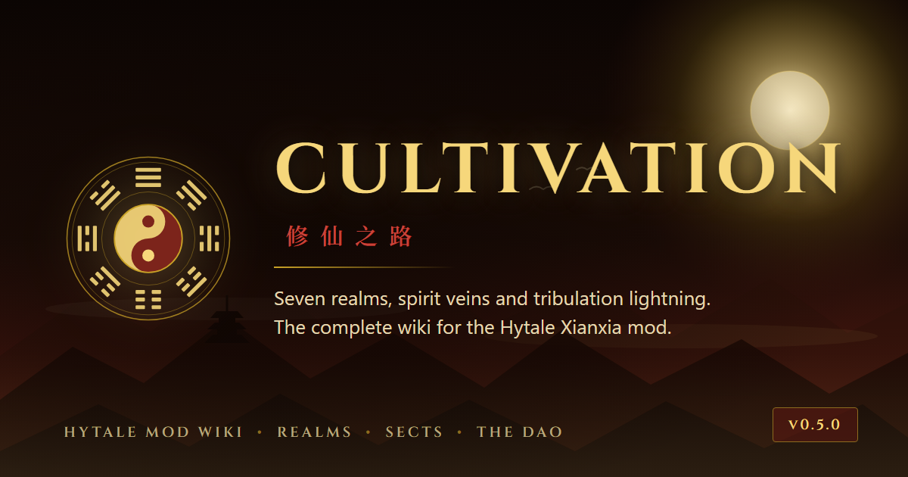

# xianxia.dev — Cultivation Wiki

The documentation site for **[Cultivation](https://www.curseforge.com/hytale/mods/cultivation/)**, a
Xianxia realm-and-Qi progression mod for Hytale.

**Live at [xianxia.dev](https://xianxia.dev)** · 41 pages · no build step, no dependencies



Static HTML, CSS and vanilla JS. There is no framework, no bundler, no `package.json` and no
Gemfile — GitHub Pages serves the files exactly as they sit in this repo. The Python scripts in
`tools/` generate content and assets; they are never needed to *serve* the site.

---

## Preview locally

```bash
python tools/serve.py
```

Opens <http://localhost:8000>. Standard library only — no `pip install`.

> **Do not open `index.html` from disk.** Pages are directory-index files served at clean URLs
> (`realms/index.html` is reached as `/realms/`), and `file://` shows a directory listing instead of
> resolving them. The local server also serves the themed 404 and sends no-cache headers, matching
> what GitHub Pages does.

`python tools/serve.py 8080` for a different port, `--no-open` to skip launching a browser.

---

## Structure

```
index.html            Landing page (hero scene is inline SVG, scoped to this file)
404.html              Not-found page (the only file using root-absolute paths)
<slug>/index.html     Every wiki page — served at /<slug>/
assets/css/           xianxia.css — the entire theme, all tokens at the top
assets/js/            site.js (chrome, search, TOC, theme) · planner.js · calculator.js
assets/img/           Logo, generated SVG ornaments, social card
data/nav.js           Navigation — single source of truth for the top bar AND sidebar
data/search-index.js  GENERATED — do not hand-edit
data/skilltree.js     GENERATED — do not hand-edit
tools/                Build and generation scripts (see below)
CNAME                 xianxia.dev
.nojekyll             Tells Pages to serve files as-is rather than running Jekyll
```

Page chrome — header, sidebar, table of contents, footer, search — is **injected at runtime by
`assets/js/site.js`**. A page file contains only its own `<main>` plus empty placeholder divs, so
the chrome lives in exactly one place.

---

## Which pages are generated?

**30 of the 41 pages are generated** from the Markdown that powers the older
`mermaids.dev/cultivation/` docs. Editing those HTML files directly is pointless — the next
conversion run overwrites them. Edit the Markdown instead, then re-run the pipeline.

> ⚠️ The Markdown source lives **outside this repo**, at `../mermaids.dev/cultivation/`.
> `tools/convert_docs.py` will not run without it. Everything else in `tools/` is self-contained.

**11 pages are hand-authored** and safe to edit directly:

`index.html` (home) · `getting-started` · `realms` · `qi-gathering` · `faq` · `glossary` ·
`presets` · `addons` · `changelog` · `planner` · `calculator`

---

## The pipeline

Run from the repo root, in this order:

```bash
python tools/convert_docs.py     # Markdown -> pages (applies tools/enhance.py automatically)
python tools/stamp_meta.py       # Open Graph / Twitter / canonical tags
python tools/build_index.py      # search index
```

| Script                   | Does                                                                                                                                                         |
| ------------------------ | ------------------------------------------------------------------------------------------------------------------------------------------------------------ |
| `convert_docs.py`        | Converts the source Markdown into themed pages. Purpose-built Markdown subset parser — no third-party dependency.                                            |
| `enhance.py`             | Presentation layer applied *after* conversion: promotes chosen blocks into card grids, callouts and panels. Imported by `convert_docs.py`, not run directly. |
| `stamp_meta.py`          | Writes the social/canonical `<meta>` block into every page. **Holds the site's public URL.**                                                                 |
| `build_index.py`         | Rebuilds `data/search-index.js` from the rendered pages.                                                                                                     |
| `make_skilltree_data.py` | Regenerates `data/skilltree.js` from the mod's skill tree registry. Only needed when the mod's tree changes.                                                 |
| `make_card.py`           | Renders `tools/card.html` to the 1200×630 `social-card.png` using headless Edge/Chrome.                                                                      |
| `make_art.py`            | Regenerates the bagua seal, ink divider and favicon SVGs.                                                                                                    |
| `serve.py`               | Local preview server.                                                                                                                                        |

### Changing the domain

`SITE_URL` at the top of `tools/stamp_meta.py` is the one place the public address is written.
Social crawlers do not run JavaScript, so `og:url` and `og:image` must be absolute and real HTML —
they cannot be injected by `site.js` like the rest of the chrome.

Change it, re-run `python tools/stamp_meta.py`, and update `CNAME`. Re-running is safe: the block is
delimited and replaced wholesale, never duplicated.

---

## Adding a page

1. **Create `<slug>/index.html`.** Copy an existing hand-authored page — `faq/index.html` is a good
   template. Keep the four placeholder divs (`site-header`, `site-sidebar`, `site-toc`,
   `site-footer`) and write only your content inside `<main class="content">`. `data-root` on
   `<html>` is `../` for any page, `""` only for the root `index.html`.

2. **Register it in `data/nav.js`** — one line in the relevant `sections` group. The sidebar,
   footer and prev/next links all read from this file. Href ends in a slash and never `.html`.

3. **Rebuild:**
   ```bash
   python tools/stamp_meta.py && python tools/build_index.py
   ```
   Commit the regenerated `data/search-index.js` with your page.

> Slugs live at the repo root, so a new slug must never collide with `assets`, `data` or `tools`.
> `convert_docs.py` aborts rather than proceed if one would.

---

## Interactive tools

Both are driven by data ported from the mod's own Java, so they match the game rather than
approximating it.

**[Skill Tree Planner](https://xianxia.dev/planner/)** — all 117 nodes across nine branches.
`tools/make_skilltree_data.py` is a direct port of the mod's `SkillTreeRegistry.build()` and asserts
117 nodes, 28 points per branch and valid prerequisite references, so it fails loudly if the Java
drifts. Builds are shared as a base64url bitmask in the URL hash — a full build fits in ~20
characters.

**[Qi Calculator](https://xianxia.dev/calculator/)** — uses the mod's real curve from
`CultivationManager.getQiRequiredForNext`:

```
required = Base-Qi-Requirement
         × Realm-Base-Multiplier  ^ realmIndex
         × Substage-Growth-Rate   ^ stageIndex
         × Realm-Breakthrough-Multiplier   (Peak stage only)
         × (1 − Qi cost reduction)
```

Both pages carry an explicit warning that their numbers are the mod's shipped defaults — a retuned
config or a progression-replacing add-on will not match.

---

## Theme

The palette is lifted from the mod's own in-game `CultivationTheme.ui` so the site and the menus
read as one artifact: ink `#1D0D07`, crimson lacquer `#35100B`, button crimson `#5C1712`, gold
`#F6D77B`, parchment `#E4D6B0`.

Two modes, toggled by the taiji button in the header and remembered in `localStorage`:

- **Yin** (default) — night ink, gold text, lacquered panels
- **Yang** — aged paper, cinnabar and ink

Everything is driven by CSS custom properties in the `:root` / `html[data-theme="light"]` blocks at
the top of `assets/css/xianxia.css`. Change a colour once there and it propagates — including into
the mermaid diagrams, which are re-themed in JS from the same values.

> When adding a colour, check it in **both** modes. Light mode is where things break: any token
> that is gold-on-lacquer in dark mode needs a separate value against the paper background. That is
> why `--active-text` exists.

### Content components

| Class                                  | What it is                                            |
| -------------------------------------- | ----------------------------------------------------- |
| `.panel` + `.panel-head`               | Lacquered container with a crimson title bar          |
| `.note`, `.note.tip`, `.note.warn`     | Callouts                                              |
| `.grid.cols-2` / `.cols-3` + `.card`   | Card grids (`.card-han` adds a watermark glyph)       |
| `.realm-track` + `.realm-row`          | The realm ladder; set `--realm` for the accent colour |
| `.chip`, `.chip.jade`, `.chip.crimson` | Inline tags                                           |
| `.btn`, `.btn.ghost`                   | Buttons                                               |
| `.qi-meter`                            | Thin progress bar                                     |
| `.mermaid-wrap` + `.mermaid-cap`       | Framed diagram with a caption                         |
| `.divider-ink`                         | Ink-brush section divider                             |
| `.tool-bar` + `.field`                 | Form controls for the interactive tools               |
| `.readout` + `.stat`                   | Result tiles                                          |

Tables need no wrapper — `site.js` makes them scrollable automatically.

### Features

- **Search** — `Ctrl`/`Cmd` + `K` or `/`, arrow-key navigation. Indexed per `<h2>` section, so hits
  land on the right anchor.
- **Mermaid diagrams** — write `<pre class="mermaid">` and it renders, re-themed on toggle. Escape
  any HTML inside labels (`&lt;br/&gt;`) — the browser parses the block before mermaid sees it.
- **Auto TOC** with scroll-spy and heading anchors; **prev/next** derived from `nav.js`.
- **Responsive** — sidebar collapses to a drawer under 900px.
- **Accessible** — skip link, focus rings, `prefers-reduced-motion` disables the qi motes, the
  drifting mist and the rotating seal.

---

## Deployment

GitHub Pages, deploying from `main` / root. `CNAME` points at `xianxia.dev` and `.nojekyll` stops
Pages from running Jekyll over the files. There is no Actions workflow — pushing to `main` is the
deploy.

---

## Licence

Wiki content © Siren. The Cultivation mod is available on
[CurseForge](https://www.curseforge.com/hytale/mods/cultivation/), with source on
[GitHub](https://github.com/meFroggy/Cultivation).
