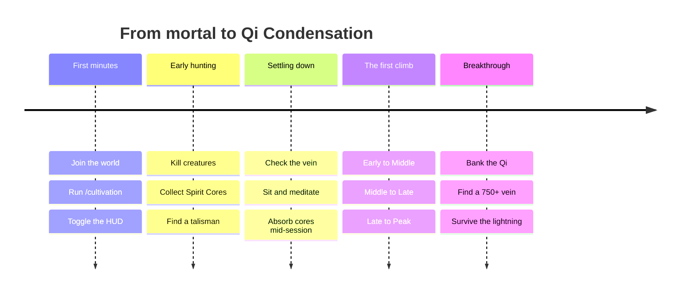

# Getting Started

Install the mod, then spend your first hour learning the loop that carries you all the way to Void Refinement: gather Qi, sit down, break through.

## Installation

<CardGrid cols={2}>
  <Card title="Client / Singleplayer" han="客">
    Drop `Cultivation.jar` into:

    ```
    %appdata%\Hytale\UserData\Mods\
    ```
  </Card>

  <Card title="Server" han="服">
    Drop `Cultivation.jar` into your server's:

    ```
    mods\
    ```
  </Card>
</CardGrid>

<Note kind="warn" title="Delete the old jar first">
  Remove any previous version of `Cultivation.jar` before adding a new one. Two copies on the classpath will conflict and the server will refuse to boot cleanly.
</Note>

Cultivation works in **singleplayer and multiplayer**. On a server, only the server needs the jar for the systems to run — but players without it will not see the custom menus.

## Your First Hour



*The opening loop, start to first breakthrough*

### 1. Turn on the HUD

Run `/cultivation hud`. You get a persistent corner panel showing your realm, stage, Qi progress and any active ritual progress. You can move it to any of the four corners from `/cultivation settings`.

`/cultivation` on its own opens the full stats page; `/cultivation info` prints the same numbers to chat if you would rather not open a menu.

### 2. Earn your first Qi

Two sources, covered in full on [Qi Gathering](/qi-gathering/):

- **Kill creatures** for a chance at a Spirit, Profound or Divine Core. Right-click a core to absorb it instantly.
- **Meditate** with `/cultivation meditate` to draw ambient Qi out of the chunk you are sitting in.

<Note kind="tip" title="Do both at once">
  Absorbing a core while you are already meditating pays a bonus on top of the core's normal value. Hoard your cores and cash them in during a meditation session.
</Note>

### 3. Advance through the stages

Sub-stage advancements (Early → Middle → Late → Peak) are short rituals — 8 seconds at the bottom of the ladder — and they need only **200** Qi in the chunk's vein. They happen as soon as you have banked enough Qi and sat down.

### 4. Survive your first breakthrough

Going from Peak of one realm into the next is a different animal. You need a chunk vein holding **750+** Qi, a 24-second uninterrupted ritual, and the nerve to sit still while tribulation lightning comes down on you.

<Note kind="warn" title="Do not stand up">
  Moving away from where you sat down — or cancelling manually — **demotes you a sub-stage** and wipes your banked Qi. Breakthrough lightning is also genuinely lethal. Go in at full health, and read [Realms & Stages](/realms/) before you try.
</Note>

## What Opens Up Next

The realm ladder is only the spine. Each of these unlocks as you climb:

| Unlocks at | System | What it gives you |
| --- | --- | --- |
| <Chip>Golden Core</Chip> | Races | A one-time choice of Human, Demon or Deity, each with its own stat profile |
| Every rank-up | Skill Tree | Points to spend across nine branches, +1 per advancement and +3 per breakthrough |
| Configurable | The Dao | An element on the Wu Xing ring, a drifting Yin-Yang balance, and a Devil/Righteous path |
| Any realm | Life-Bound Treasures | `/cultivation bind` ties a weapon or armour piece to you so it levels from use |
| Any realm | Sects | Found a guild, claim a hall on a dragon vein, and eventually go to war over one |

## For Server Owners

Every number in the mod lives in a themed JSON config file — nothing is hardcoded — and the ones you are most likely to touch can be edited **live in-game** through `/cultivation admin`, with no file editing and no restart.

<Panel title="Config Files">
  | File | Covers |
  | --- | --- |
  | `Config.json` | Core Qi curve and per-level stat bonuses |
  | `SpiritCoreConfig.json` | Core drop chances and Qi values |
  | `SpiritVeinConfig.json` | Spirit Vein tuning, meditation timing, the talisman |
  | `BreakthroughConfig.json` | Ritual requirements, durations, tribulation toggles |
  | `LifeBoundConfig.json` | Life-Bound XP curve and combat bonuses |
  | `RaceSystemConfig.json` | Cross-race server behaviour and admin overrides |
  | `Race/*.json` | Each race's own bonuses and flavour text |

  Config files carry human-readable descriptions next to the less obvious settings.
</Panel>

## Permissions

| Permission | Grants |
| --- | --- |
| `cultivation` | The base command and every player-facing subcommand |
| `cultivation.admin` | All `/cultivation admin` subcommands and the admin menu |
| `cultivation.debug` | The debug command group |
| `cultivation.debug.vein` | `/cultivation debug vein` |

<Note title="Languages">
  Cultivation is fully localised in **English** and **Simplified Chinese** (with proper Xianxia terminology throughout), plus partial translations for Portuguese (Brazil), Russian and Ukrainian.
</Note>
