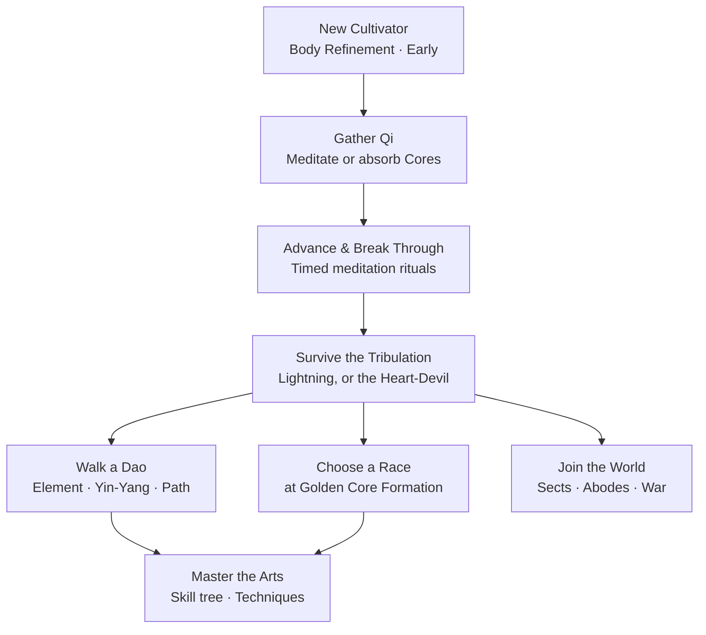

## The Path at a Glance

Every cultivator walks the same opening road — gather Qi, climb the realms, endure the tribulation — and then chooses how to spend the power that road grants them.

*The opening road, and where it forks*

<Divider />

## Systems

Cultivation is built as a stack of independent systems. You can run only the realm ladder, or turn on every one of these.

<CardGrid cols={3}>
  <CardLink href="/realms/" title="Realms & Stages" han="境">
    Seven realms, four sub-stages each. Advancement is routine; breakthrough is a ritual you can fail.
  </CardLink>

  <CardLink href="/qi-gathering/" title="Qi Gathering" han="氣">
    Meditate to drain a chunk's Spirit Vein, or hunt creatures for Spirit, Profound and Divine Cores.
  </CardLink>

  <CardLink href="/tribulations/" title="Tribulations" han="劫">
    Lightning falls on every breakthrough. Lean too far into Yin or Yang and you face the Heart-Devil Trial instead.
  </CardLink>

  <CardLink href="/dao/" title="The Dao" han="道">
    Ten elemental daos on a Wu Xing counter-ring, a drifting Yin-Yang balance, and a Devil/Righteous path split.
  </CardLink>

  <CardLink href="/techniques/" title="Techniques" han="術">
    Active arts learned from lootable manuals — fly on your sword, cross a valley in one step, call down a thunder palm.
  </CardLink>

  <CardLink href="/sects/" title="Sects & War" han="宗">
    Found a sect, claim a hall on a dragon vein, raise formations, and take a rival's mountain by siege.
  </CardLink>

  <CardLink href="/alchemy/" title="Alchemy" han="丹">
    Brew pills that steady a ritual, ward off the inner demon, or push a stubborn breakthrough over the line.
  </CardLink>

  <CardLink href="/beasts/" title="Spirit Beasts" han="獸">
    Tame or hatch companions that cultivate their own realm beside you as Guardian, Gatherer or Warden.
  </CardLink>

  <CardLink href="/profiles/" title="Profiles" han="身">
    Keep up to three separate cultivators on one account — start again from Body Refinement without losing the soul you spent a month on.
  </CardLink>

  <CardLink href="/auras/" title="Auras" han="芒">
    Realm-colored Qi pours off every cultivator — read a stranger's realm and stage from across a field, before a word is spoken.
  </CardLink>

  <CardLink href="/titles/" title="Titles" han="号">
    Earned, purely cosmetic titles worn above your head, in chat, on the rankings and on your sect's roster.
  </CardLink>

  <CardLink href="/api/" title="Public API" han="匠">
    160 events across thirteen subsystems, open registries, and a provider hook that lets a mod replace the ladder entirely.
  </CardLink>
</CardGrid>

<Divider />

## The Seven Realms

Every player starts at Body Refinement, Early-Stage. Each realm grants additive max health and a percentage damage bonus, so the gap between a mortal and a Void Refiner is enormous.

<RealmTrack>
      <Realm color="#9E8B78" medal="體" name="Body Refinement" sub="Where every mortal begins — tempering flesh before energy." tier="REALM I" />
      <Realm color="#7EA8D9" medal="氣" name="Qi Condensation" sub="Ambient spirit energy first gathers and holds inside the body." tier="REALM II" />
      <Realm color="#6FBF9B" medal="築" name="Foundation Establishment" sub="The base is laid; progress stops being reversible by accident." tier="REALM III" />
      <Realm color="#E0B44C" medal="丹" name="Golden Core Formation" sub="A core forms. Your race may be chosen here, once." tier="REALM IV" />
      <Realm color="#A98BD1" medal="嬰" name="Nascent Soul" sub="The soul takes an infant form and can act apart from the body." tier="REALM V" />
      <Realm color="#D97E7E" medal="神" name="Soul Formation" sub="Soul and body fuse into something no longer quite human." tier="REALM VI" />
      <Realm color="#F6D77B" medal="虛" name="Void Refinement" sub="The last realm before the mortal world stops being enough." tier="REALM VII" />
    </RealmTrack>

      <ButtonLink href="/realms/" ghost>Full realm mechanics →</ButtonLink>
    

<Divider />

## Start Here

<CardGrid cols={2}>
  <CardLink href="/getting-started/" title="Installation & First Steps">
    Get the jar in the right folder, then your first hour: meditate, absorb a core, and reach Qi Condensation.
  </CardLink>

  <CardLink href="/qi-gathering/" title="How Qi Actually Works">
    Spirit Veins, vein tiers, the talisman, core drop rates, and why over-farming one chunk stops paying.
  </CardLink>

  <CardLink href="/commands/" title="Every Command">
    The full `/cultivation` and `/sect` trees, their aliases, arguments and permissions.
  </CardLink>

  <CardLink href="/config/" title="Server Configuration">
    Every tunable value in the mod, grouped by file — and how to edit them live without touching JSON.
  </CardLink>
</CardGrid>

<Panel title="Quick Reference">
  | Command | Does |
  | --- | --- |
  | `/cultivation` | Open your cultivation stats page |
  | `/cultivation meditate` | Sit and draw Qi from the chunk's Spirit Vein |
  | `/cultivation hud` | Toggle the persistent corner HUD |
  | `/cultivation race` | Open the race menu (Golden Core Formation and up) |
  | `/cultivation admin` | Live in-game config editor <Chip>admin</Chip> |

  Aliases: `/cult` and `/qi` both work anywhere `/cultivation` does.
</Panel>
