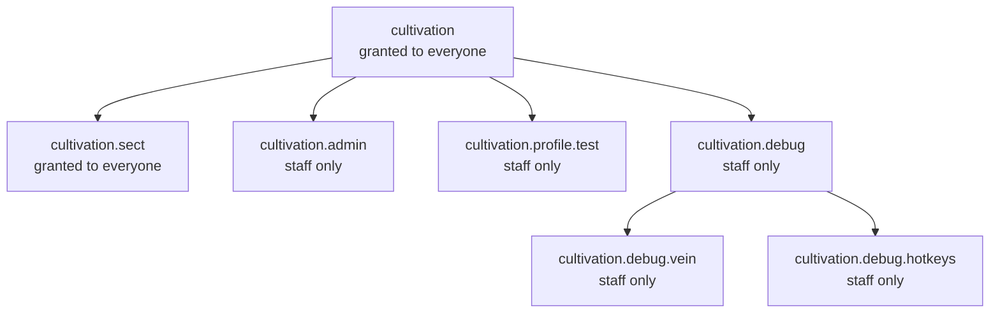

# Permissions

The mod declares seven permission nodes. Every command in the mod sits behind one of them - see [Commands](/commands/) for which command needs which.

<Panel title="Permissions">
  | Permission | Description |
  | --- | --- |
  | `cultivation` | The `/cultivation` root and every player-facing subcommand under it - info, bind, meditate, hud, settings, race, skilltree, dao, technique, refine, respec, bonuses, formations, abode, beast, duel, top, profile, aura. |
  | `cultivation.sect` | The `/sect` root and every sect subcommand, including `/sect war`, `/sect banner` and `/sect top`. The same suite reached through `/cultivation sect ...` uses this node too. |
  | `cultivation.admin` | The `/cultivation admin` config editor UI, its player-modifying subcommands, and the `/cultivation admin test` tree. |
  | `cultivation.profile.test` <Tag>v0.7.0</Tag> | The test-profile sandbox on your own account: `/cultivation profile test` and its realm/stage/qi/points/race/reset branches. Since v0.7.3 the sandbox is command-only — it no longer appears in the [Profiles](/profiles/) menu, and granting one to *another* player is `cultivation.admin` instead. |
  | `cultivation.land.bypass` | Ignores every [land claim's](/land/) rules, everywhere — sect halls, sect ground and cave abodes alike. |
  | `cultivation.debug` | The `/cultivation debug` command group. |
  | `cultivation.debug.vein` | `/cultivation debug vein`. |
  | `cultivation.debug.hotkeys` | `/cultivation debug hotkeys`. |
</Panel>

<Divider />

## Hierarchy

The node names are dotted, and that dotting mirrors the command tree - `cultivation` is the root; `cultivation.sect`, `cultivation.admin`, `cultivation.profile.test` and `cultivation.debug` sit under it; and `cultivation.debug.vein` and `cultivation.debug.hotkeys` sit under the debug group. Each command requires its own node explicitly, so holding `cultivation` does not by itself confer `cultivation.admin`.

<Divider />

## What is granted by default

`cultivation` and `cultivation.sect` are both registered to the `hytale:None` group - the default group every player belongs to - so the whole player-facing experience, cultivating and sects alike, works out of the box with no permission setup.

`cultivation.admin`, `cultivation.profile.test`, `cultivation.debug`, `cultivation.debug.vein` and `cultivation.debug.hotkeys` are granted to nobody by default. They are deliberately registered with an empty permission-group list rather than left unset: an unset list falls back to the parent command's groups, which would silently hand the admin menu to every player through `hytale:None`. Server staff still reach them the normal way, through the wildcard on their own admin group.

`cultivation.profile.test` is worth granting more deliberately than the others: it is not a debug convenience but a player-usable sandbox - anyone holding it can spin up a temporary cultivator with any realm, stage and Qi typed in by hand. A test cultivator is kept out of the rankings, sect scores and sect rosters, so the node is safe to hand to trusted balance-testers - but nothing about it is meant for `hytale:None`.
