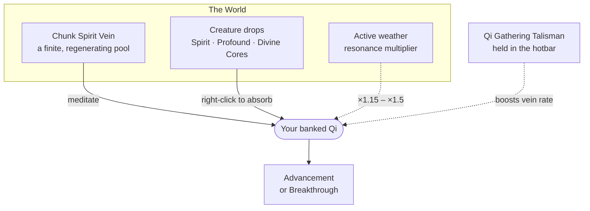

# Qi Gathering

Qi is the currency of the whole mod — it buys every advancement and every breakthrough. There are two ways to earn it, and they are deliberately better together than apart.

*Everything that feeds your Qi pool*

## Meditation & Spirit Veins

`/cultivation meditate` sits your character cross-legged and slowly draws ambient energy from the **Spirit Vein** of the chunk you are standing in. A Spirit Vein is a real per-chunk energy pool: it has a capacity, it depletes as you draw from it, and it regenerates over time. Camp on one chunk long enough and it will run dry, and your Qi-per-second falls with it until it recovers.

<Note kind="tip" title="Move around">
  Because veins deplete locally and regenerate on their own clock, the fastest way to gather is to rotate between a few good chunks rather than sit on one forever. Use `/cultivation debug vein` to read the current chunk's remaining Qi.
</Note>

### The Land Has Shape

A vein's strength is not rolled fresh for each chunk. It is laid out as a **landscape**: the Qi rises and falls across the world like terrain, so neighbouring chunks form slopes and ridges over roughly eight chunks at a time. Walk one way and it climbs; walk back and it falls.

That is what makes the ground worth reading. A run of chunks looks like `459 → 432 → 445 → 428 → 409 → 369` — a slope you can follow — rather than the `417 → 175 → 216 → 324` of an independent roll per chunk, where the only strategy was to keep hopping and hope.

<Note title="Follow the Qi uphill and you arrive somewhere">
  Rich and dragon veins **gather into spirit-rich regions** rather than being sprinkled evenly, so finding one is a reason to search the surrounding land. Their rarity is unchanged — still exactly the odds the config asks for, only redistributed toward potent ground. [Spirit Sense](/spirit-sense/) is how you read the slope without walking it.
</Note>

Server owners: `Spirit-Vein-Terrain-Jitter-Percent` (default 6) is how far one chunk may stray from that surface, as a percent of its band. A few percent keeps the numbers from looking mathematical; a large value brings back the old spiky field. Existing worlds **keep the veins they already seeded** — only ground no cultivator has visited is laid out the new way.

### Vein Tiers

Not every chunk is equal. Most are ordinary, but some are richer, and a rare few sit on a dragon vein — the chunks worth fighting a sect war over.

<CardGrid cols={3}>
  <Card title="Common Vein" han="凡">
    The baseline. Regenerates at the standard rate.
  </Card>

  <Card title="Rich Vein" han="靈">
    A noticeably faster regeneration multiplier — worth returning to.
  </Card>

  <Card title="Dragon Vein" han="龍">
    The best land in the world. Sect halls and cave abodes are claimed on these.
  </Card>
</CardGrid>

<Note kind="warn" title="Server owners: the drain rule">
  A vein's regeneration multiplied by its tier bonus must stay **below** the meditation drain rate. If regen × multiplier ever exceeds drain, that chunk becomes an infinite Qi fountain and the entire progression curve stops mattering.
</Note>

### Where the Qi Comes From

Meditating does not empty the square you are sitting on. The draw is **split across five chunks**: half from the one beneath you, and an eighth from each of the four around it.

<CardGrid cols={3}>
  <Card title="50% — Beneath you" han="中">
    The chunk you are sitting in carries half the draw on its own.
  </Card>

  <Card title="12.5% each — The four around" han="四">
    North, south, east and west each give an eighth.
  </Card>

  <Card title="A reason to move on" han="移">
    A share the ground cannot supply is simply not drawn — it does not spill into the others.
  </Card>
</CardGrid>

Your *rate* is unchanged by this — only where it comes from. But a favourite spot no longer hollows out one square while its neighbours sit full, and what a place yields now depends on the whole neighbourhood rather than on a single chunk. Sit where four exhausted chunks meet and you draw only the centre's half.

The [Vein Drain Radius](/skilltree/) skill lengthens each of the four arms, so an arm whose nearest chunk is spent reaches further out for *its own* share. It is not a way to draw more — it is what keeps a high cultivator at their full rate in land that has already been worked over.

### The Qi Gathering Talisman

Hold a **Qi Gathering Talisman** anywhere in your hotbar while meditating and your Spirit Vein absorption rate goes up. It does not need to be in your hand — carrying it is enough. Rate and behaviour are set in `SpiritVeinConfig.json`.

## Cultivation Cores

Killing creatures has a chance to drop a cultivation core. Right-click one to absorb it for an instant chunk of Qi — no meditation required, which makes cores the answer when you want to progress while doing something else.

| Core | Rarity | Role |
| --- | --- | --- |
| <Chip>Spirit Core</Chip> | Common | The everyday drop. Small, steady Qi. |
| <Chip>Profound Core</Chip> | Uncommon | A meaningful jump — worth saving for a ritual. |
| <Chip>Divine Core</Chip> | Rare | Large enough to carry a stubborn breakthrough on its own. |

<Note kind="tip" title="Stack the two sources">
  Absorbing a core *while you are already meditating* grants a bonus on top of the core's normal Qi value. Save your cores for a meditation session rather than absorbing them on sight.
</Note>

Drop chances and Qi values for all three cores live in `SpiritCoreConfig.json`.

## Weather Resonance

The sky matters. Meditating during active weather grants a Qi multiplier, and the multiplier is larger when the weather matches the element of the Dao you walk.

| Condition | Multiplier |
| --- | --- |
| Weather matching your chosen dao element | **×1.5** |
| Any other active weather | **×1.15** |
| Clear skies | ×1.0 |

Which weather maps to which element is itself configurable, by keyword, in `DaoConfig.json` — so a server using custom weather assets can wire them in without any code.

<Divider />

## Putting It Together

An efficient early loop looks like this:

1. Hunt until you have a handful of cores and a Qi Gathering Talisman.
2. Find a rich chunk with `/cultivation debug vein` and sit down.
3. Meditate through the weather if there is any — rain pays better than clear sky.
4. Absorb your saved cores *during* the session for the stacking bonus.
5. When the vein thins out, move a few chunks over and repeat.

<Panel title="Related Config">
  | File | Covers |
  | --- | --- |
  | `SpiritVeinConfig.json` | Vein capacity, regeneration, tiers, meditation timing, talisman |
  | `SpiritCoreConfig.json` | Core drop chances and Qi values |
  | `DaoConfig.json` | Weather → element keyword mapping and resonance multipliers |
  | `Config.json` | The Qi curve every one of these feeds into |
</Panel>
