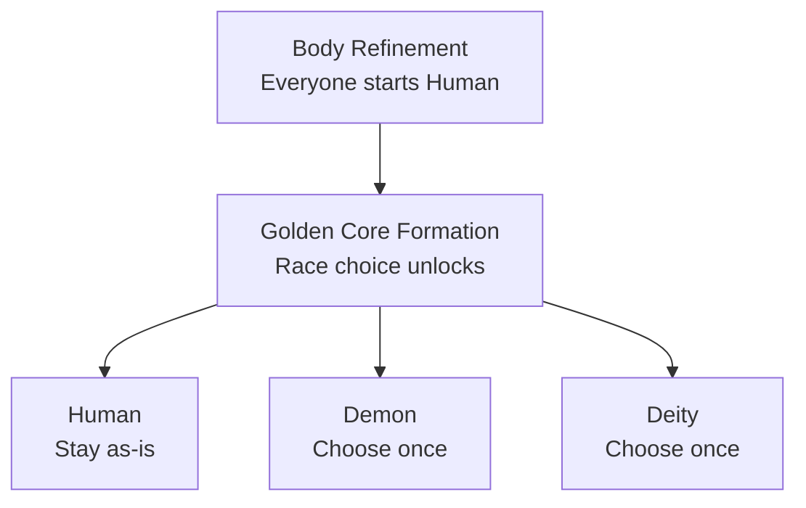

# Races

Every player starts as **Human**. Reaching **Golden Core Formation** unlocks a one-time choice to become **Demon** or **Deity** instead (or stay Human), made through a dedicated race menu (`/cultivation race`) that shows each race's live, config-driven bonuses before you pick. Used your one choice already? An admin can grant more with `/cultivation admin grantracechoice`.

Each race grants its own bonuses to max health, damage, Qi gain rate and breakthrough speed, and its own Yin bias on the qi it absorbs. Every value is rebalanceable without recompiling, and the bonuses shown in-game are always the live, current ones.

## Available Races

| Race | Unlock Realm | Health | Damage | Qi Gain | Breakthrough Speed | Yin Bias |
| --- | --- | --- | --- | --- | --- | --- |
| [Human](/races/#human) | Body Refinement | +0% | +0% | +10% | +0% | 0% |
| [Demon](/races/#demon) | Golden Core Formation | -10% | +25% | -10% | +0% | +50% |
| [Deity](/races/#deity) | Golden Core Formation | +20% | -10% | +5% | 20% faster | -30% |

**Yin bias** (`Qi-Alignment-Yin-Bias-Percent`) skews how meditated qi lands on your Yin-Yang balance: a Demon at +50% turns half of what would have been Yang into Yin instead, a Deity at -30% purifies 30% of would-be Yin into Yang. It is the single largest nudge toward the Devil or Righteous path - see [The Dao](/dao/).

By default an admin using `/cultivation admin setrace` (or the admin UI's Set Race action) can bypass a race's unlock-realm requirement entirely - set `Race-Admin-Bypasses-Realm-Gate` to false to hold admin overrides to the normal gate too.

<Divider />

## An Open Registry

Races are no longer a closed list. Another mod can register a brand-new race through `CultivationAPI.registerRace`, backed by its own config file or a plain constant, and it shows up in the race menu right alongside Human, Demon and Deity - with its own unlock realm, its own bonuses and its own Yin bias. Built-in and third-party races run through exactly the same code path. See [Registries](/api-registries/) for how to add one.

<Panel title="Commands">
  | Command | Description | Permission |
  | --- | --- | --- |
  | `/cultivation race` | Open the race selection menu. | `cultivation` |
  | `/cultivation admin setrace` | Force a player's race. | `cultivation` |
  | `/cultivation admin grantracechoice` | Give a player another race choice. | `cultivation` |
</Panel>

Per-race values live in one config file per race - see [Race Configs](/config-race/) - while the cross-race server behaviour sits in `Cultivation/RaceSystemConfig.json`, on the [Cultivation Configs](/config-cultivation/) page. The commands above are documented in full on the [Commands](/commands/) page.

<Divider />

## Human

<Note>
  Adaptable and quick to learn. No combat extremes, but Qi flows a little more readily.
</Note>

Every player starts as Human, and can choose to stay Human when the race choice unlocks at Golden Core Formation. It is the balanced, generalist option - no combat downsides, and the best raw Qi gain rate of the three built-in races.

### Bonuses

| Bonus | Value |
| --- | --- |
| Unlock Realm | Body Refinement (available from the start) |
| Max Health | +0% |
| Outgoing Damage | +0% |
| Qi Gain Rate | +10% |
| Breakthrough Duration | +0% (no change) |
| Qi Alignment Yin Bias | 0% (neutral) |

A neutral Yin bias means a Human's meditated qi lands on the Yin-Yang balance exactly as the chunk's own alignment dictates, with no racial thumb on the scale. That makes Human the easiest race to hold near a balanced 50/50 split, which is where the balance bonus to all Qi gain and damage lives - see [The Dao](/dao/).

See the [Races](/races/) overview for how these compare to Demon and Deity, and [Config](/config-race/) for how to retune them on your own server.

<Divider />

## Demon

<Note>
  Brutal and battle-hungry. Ferocious in combat, but crude cultivation technique slows their Qi gathering.
</Note>

Demon is a combat-focused choice, unlocked once you reach Golden Core Formation. It trades a chunk of max health and a noticeably slower Qi gain rate for the single largest damage bonus of the three built-in races.

### Bonuses

| Bonus | Value |
| --- | --- |
| Unlock Realm | Golden Core Formation |
| Max Health | -10% |
| Outgoing Damage | +25% |
| Qi Gain Rate | -10% |
| Breakthrough Duration | +0% (no change) |
| Qi Alignment Yin Bias | +50% |

That +50% Yin bias is the real character of the race: half of the Yang a Demon would have absorbed from a good chunk becomes Yin instead, so a Demon drifts toward a deep Yin lean simply by cultivating. Deep Yin unlocks the Yin lean powers (bonus damage and lifedrain) and, past the path threshold, the **Devil Path (魔道)** - which harvests Qi from slain players but attracts [karma](/karma/) faster and faces the Heart-Devil Trial instead of ordinary [tribulation lightning](/tribulations/). See [The Dao](/dao/) for the whole balance system.

See the [Races](/races/) overview for how these compare to Human and Deity, and [Config](/config-race/) for how to retune them on your own server.

<Divider />

## Deity

<Note>
  Blessed with a heavenly constitution. Sturdy and swift to break through, though less fierce in a fight.
</Note>

Deity is a survivability- and progression-focused choice, unlocked once you reach Golden Core Formation. It grants the largest health bonus of the three built-in races and speeds up every ritual, at the cost of some outgoing damage.

### Bonuses

| Bonus | Value |
| --- | --- |
| Unlock Realm | Golden Core Formation |
| Max Health | +20% |
| Outgoing Damage | -10% |
| Qi Gain Rate | +5% |
| Breakthrough Duration | -20% (rituals take 20% less time) |
| Qi Alignment Yin Bias | -30% |

The duration reduction applies to sub-stage advancements and [weapon refinement](/refinement/) as well as realm breakthroughs, and stacks multiplicatively with the skill tree's Ritual Speed and an active Clarity Pill. Reductions are clamped in code so no combination can cut a ritual by more than 90%.

The -30% Yin bias purifies nearly a third of the Yin a Deity would otherwise absorb into Yang, so a Deity drifts toward a deep Yang lean over time - the Yang lean powers (incoming-damage reduction and stronger received healing) and, past the path threshold, the **Righteous Path (正道)**. See [The Dao](/dao/).

See the [Races](/races/) overview for how these compare to Human and Demon, and [Config](/config-race/) for how to retune them on your own server.
