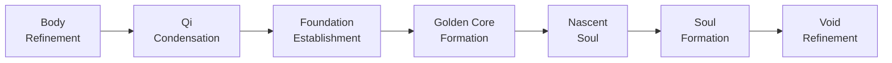
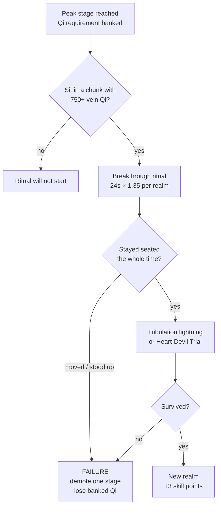

# Realms & Stages

Every player starts at **Body Refinement, Early-Stage** and climbs toward immortality through **seven realms**, each split into **four sub-stages**: Early, Middle, Late and Peak. Twenty-eight rungs in all.

*The seven realms, in order*

## The Ladder

Within each realm you advance **Early → Middle → Late → Peak**, then **break through** into the next realm's Early-Stage. Higher realms and stages grant additive max health and a percentage damage bonus, both tuned in `Config.json`.

<RealmTrack>
      <Realm color="#9E8B78" medal="體" name="Body Refinement" sub="Tempering flesh and sinew before a single wisp of energy will hold." tier="REALM I" />
      <Realm color="#7EA8D9" medal="氣" name="Qi Condensation" sub="Ambient spirit energy finally gathers and stays inside the body." tier="REALM II" />
      <Realm color="#6FBF9B" medal="築" name="Foundation Establishment" sub="The base is laid. From here the climb is steep but no longer fragile." tier="REALM III" />
      <Realm color="#E0B44C" medal="丹" name="Golden Core Formation" sub="A core forms in the dantian — and your one-time race choice unlocks." tier="REALM IV" />
      <Realm color="#A98BD1" medal="嬰" name="Nascent Soul" sub="The soul takes an infant form and can act briefly apart from the body." tier="REALM V" />
      <Realm color="#D97E7E" medal="神" name="Soul Formation" sub="Soul and body fuse into something the mortal world no longer recognises." tier="REALM VI" />
      <Realm color="#F6D77B" medal="虛" name="Void Refinement" sub="The last realm the mod ships — and the last one the world can hold." tier="REALM VII" />
    </RealmTrack>

## Advancements vs. Breakthroughs

Both are real, timed meditation rituals. Bank enough [Qi](/qi-gathering/), sit down in a chunk whose Spirit Vein holds enough energy, and the ritual progresses for as long as you keep meditating.

The chunk-Qi requirement is a **presence check, not a drain** — the vein is not consumed by the ritual — but a vein that falls below the bar will pause the ritual until it regenerates.

|  | Sub-Stage Advancement | Realm Breakthrough |
| --- | --- | --- |
| **When** | Early → Middle → Late → Peak | Peak → next realm's Early-Stage |
| **Minimum chunk Qi** | 200 `Advancement-Min-Chunk-Qi` | 750 `Breakthrough-Min-Chunk-Qi` |
| **Base duration** | 8s `Advancement-Base-Seconds` | 24s `Breakthrough-Base-Seconds` |
| **Duration scaling** | ×1.3 per realm reached | ×1.35 per realm reached |
| **Tribulation lightning** | <Chip>off by default</Chip> | <Chip>on, and lethal</Chip> |
| **Skill points** | +1 `Points-Per-Advancement` | +1, plus 2 more `Points-Per-Breakthrough` |

<Note kind="warn" title="Failure costs you">
  Cancelling a ritual — by drifting away from where you sat down, or by standing up manually — **demotes you one sub-stage**, wipes your banked Qi, and revokes the skill points that stage originally granted. You are never demoted below Early-Stage of your *current* realm, so a failed breakthrough can never cost you a whole realm.
</Note>

## Ritual Flow

*What a breakthrough attempt actually runs through*

<Note title="The heavens are watching">
  Breakthrough lightning is genuinely lethal — it can kill you outright at low health. A cultivator who has leaned far enough into Yin or Yang faces the **Heart-Devil Trial** instead, which tests composure rather than hit points. Both are tunable, and advancement tribulations are off by default.
</Note>

## Tuning the Curve

Nothing here is hardcoded. The realm/stage curve and its stat rewards live in `Config.json`; the ritual requirements above live in `BreakthroughConfig.json`. Both can be edited live in-game through `/cultivation admin` without touching a file or restarting the server.

<Panel title="Related Commands">
  | Command | Does |
  | --- | --- |
  | `/cultivation` | Open the stats page — realm, stage, Qi progress |
  | `/cultivation info` | Print the same readout to chat |
  | `/cultivation meditate` | Begin the ritual (alias `/cultivation cultivate`) |
  | `/cultivation admin setrealm <player> <realm>` | Set a realm directly <Chip>admin</Chip> |
  | `/cultivation admin setstage <player> <stage>` | Set a sub-stage directly <Chip>admin</Chip> |
</Panel>
