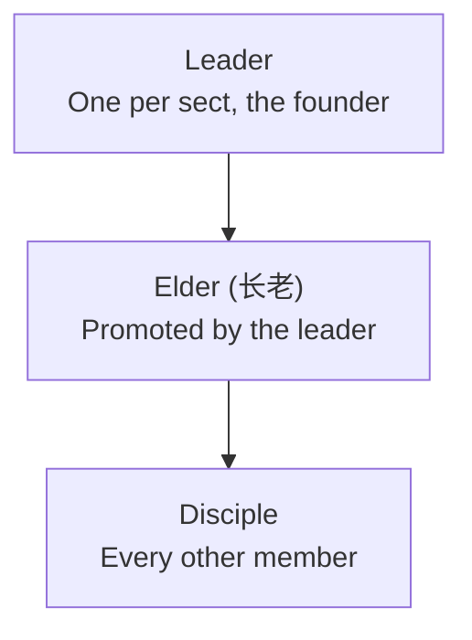

# Sects

A **Sect (宗门)** is Cultivation's guild system. Found one, gather disciples, claim a mountain of your own on a good Spirit Vein, and the whole roster cultivates faster for it. A sect that holds a hall can also carve an art into it that every disciple may wield, raise [Formations](/formations/) on its ground, grow a shared Spirit Spring in the hall, and go to [war](/wars/) over someone else's mountain.

Everything on this page is gated behind `Sects-Enabled` (default `true`). With it off, every `/sect` command refuses politely, the sect Qi bonus stops applying, and existing sect data is left on disk untouched.

<Divider />

## Founding a Sect

`/sect create <name>` founds a sect with you as its leader.

- Names are 3 to 24 characters of letters, digits, spaces, hyphens and apostrophes. Anything else is refused.
- Names are unique, case-insensitively - no two sects may share one.
- You cannot found a sect while you belong to one.
- A roster holds up to 12 members including the leader (`Sect-Max-Members`).

`/sect info` (alias `i`) prints your roster, your hall, your hall's inscription and your sect's score. `/sect leave` walks away - and drops your elder rank with you, so rejoining does not silently restore your authority. A leader may not leave; they must `/sect disband`, which dissolves the sect, disperses every formation the sect controlled, drops its pending invites, and lets its hall spring be reaped.

<Note title="Disbanding asks first">
  `/sect disband` on its own only warns you - it names the sect and counts the disciples about to be cast out. It takes `/sect disband confirm` to actually do it, and every other member is messaged the moment it happens rather than discovering an empty menu later.
</Note>

<Divider />

## Ranks: Leader, Elder, Disciple

<Note title="Ranks">
  **Elders (长老)** are the middle rank. Only the leader promotes and demotes them, from the member rows in the sect menu.
</Note>

| Action | Leader | Elder | Disciple |
| --- | --- | --- | --- |
| Invite a player (`/sect invite`) | Yes | Yes | No |
| Approve or deny a join request | Yes | Yes | No |
| Set the motto | Yes | Yes | No |
| Kick a plain disciple | Yes | Yes | No |
| Kick an elder | Yes | No | No |
| Promote or demote an elder | Yes | No | No |
| Set the join policy | Yes | No | No |
| Rename the sect | Yes | No | No |
| Claim or move the hall (`/sect claim`) | Yes | No | No |
| Inscribe or scour the hall (`/sect inscribe`) | Yes | No | No |
| Declare war (`/sect war declare <sect>`) | Yes | No | No |
| Disband the sect | Yes | No | No |

Nobody can kick the leader, and an elder who tries to kick another elder is refused. Being kicked or leaving clears your rank and any pending join request you had.

`/sect kick` matches against the sect's own roster, so **a member who is offline can still be removed** - which is usually the member you actually wanted gone. The name has to match the roster; it does not have to belong to anyone currently on the server.

<Divider />

## Join Policies

The leader picks how outsiders get in, from the dropdown in the sect menu's **My Sect** tab. New sects start on **Invite**.

| Policy | How a player joins |
| --- | --- |
| **Invite** | Only by a leader or elder running `/sect invite <player>`, then the invitee running `/sect join <name>`. |
| **By Request** | The applicant queues a request from the sect menu's Browse tab; a leader or elder approves or denies it. |
| **Open** | The applicant joins instantly from the Browse tab, no approval needed. |

Notes on invites and requests:

- An invite expires after 300 seconds (`Sect-Invite-Expiry-Seconds`). Invites are held in memory only, so a server restart clears the pending ones.
- `/sect join` only ever works against a live invite. Request and Open sects are joined through the menu, not that command.
- Pending requests appear as approve/deny rows to leaders and elders in the **My Sect** tab. They persist with the sect.
- Every path re-checks the 12-member cap, and a request from someone who has since joined another sect is discarded rather than approved.

<Divider />

## Motto and Renaming

A leader or elder can set a **motto** from the menu - free text, trimmed and capped at 60 characters. It shows under the sect name in the menu, and since v0.7.0 it is spoken at the moment it means something: the full-screen [title](/notices/) a player sees on joining or leaving the sect carries the motto underneath. (A kicked player is deliberately not shown it.)

Only the leader may **rename** the sect, and the new name goes through exactly the same validation and uniqueness check as founding one. A rename carries everything keyed to the old name along with it:

- every [Formation](/formations/) the sect controls, so the sect's own arrays do not suddenly treat its members as outsiders,
- the hall's shared Spirit Spring and everything banked in it (see [Cave Abodes](/dwelling/)),
- every pending invite, so an invitee can still accept under the new name.

<Divider />

## The Sect Hall

`/sect claim` claims the chunk you are standing in as the sect's hall. Only the leader may claim.

<Panel title="Claiming a Hall">
  - The chunk must hold a Spirit Vein of at least tier 1 - a **rich vein** - by default (`Sect-Hall-Min-Vein-Tier`; set it to 2 to require a **dragon vein**). Ordinary chunks can never host a hall, which is what makes good veins worth fighting over.
  - One hall per sect. Claiming again simply moves the hall.
  - No two sects may hold the same chunk.
</Panel>

A claimed hall pays the whole roster a **sect Qi bonus** on Qi from every source - meditation, cores, spring collection, everything - multiplied in alongside your race, skill tree, pill and Dao multipliers:

| Hall sits on | Qi bonus | Config key |
| --- | --- | --- |
| Rich vein (tier 1) | +5% | `Sect-Qi-Bonus-Percent-Rich-Hall` |
| Dragon vein (tier 2) | +8% | `Sect-Qi-Bonus-Percent-Dragon-Hall` |

A sect with no hall gets no bonus at all. Lose the hall to a siege and the bonus stops for everyone at once.

The hall also grows the sect's shared **Spirit Spring** when `Sect-Hall-Spring-Enabled` is on - it follows the hall, so moving the hall moves the spring and losing the hall hands the spring, and whatever it had banked, to the victor. See [Cave Abodes](/dwelling/) for how springs fill and are collected.

<Divider />

## Beacons and Banners

<Tag>v0.7.0</Tag> A claimed hall raises a **standing column of light** visible to *anyone* walking past, not just members - a hall is a real, contestable presence in the world rather than a record only its sect knows about. The beacon re-pulses every `Sect-Hall-Beacon-Interval-Seconds` (2.5s) and is switched off server-wide with `Sect-Hall-Beacon-Enabled` - see the [Society config](/config-society/).

By default the light matches the vein under the hall. A sect's leader or an elder can instead **fly a banner** - from the Hall Banner picker in the sect menu, or with `/sect banner set <name>`. Six ship with the mod:

| Banner | Id | Color | Group |
| --- | --- | --- | --- |
| **Azure Dragon** | `cultivation:azure` | azure | The Four Symbols |
| **Vermilion Bird** | `cultivation:vermilion` | vermilion | The Four Symbols |
| **White Tiger** | `cultivation:white` | white | The Four Symbols |
| **Black Tortoise** | `cultivation:black` | deep indigo | The Four Symbols |
| **Golden Court** | `cultivation:golden` | gold | Sect Colors |
| **Jade Terrace** | `cultivation:jade` | jade | Sect Colors |

- `/sect banner` with no argument lists what your sect may fly, marking the current one. The short name (`azure`) and the full id both work; `/sect banner set none` returns to the plain vein light.
- A sect with **no hall** can still pick its banner - it goes up the moment a hall is claimed.
- Lose the hall to a [siege](/wars/) and the light drops back to whatever the vein wanted to be - which is how a valley tells you its owners changed before any messenger does. The *choice* survives on the sect, so reclaiming a hall raises the same banner again.
- Add-ons can register more banners through [`registerSectBanner`](/api-registries/); none of the built-in six are permission-gated.

Every claimed hall is also **pinned on Hytale's own world map**, tinted with its banner's color and labelled with the sect's name - for everyone, member or not. The map pin is not affected by `Sect-Hall-Beacon-Enabled`.

<Divider />

## Hall Inscriptions

**Hall Inscriptions (碑文)** let a sect teach one art to every disciple at once. Stand in your hall holding a technique [Manual](/manuals/) and run `/sect inscribe`.

- Leader only, and you must be standing on the hall's own chunk - the art is carved into that ground in person.
- The manual is consumed, but only after the inscription actually takes. If the manual cannot be removed from your hands the inscription is rolled straight back rather than teaching the sect an art nobody paid for.
- Only manuals that teach a **technique** work. Skill-tree manuals grant permanent stat nodes and are refused, because a permanent node cannot be revoked when the hall falls.
- One inscription at a time. Inscribing again silently replaces what was there - the old art is simply gone.
- Running `/sect inscribe` **empty-handed scours the hall clean** instead, taking the art from every member and refunding nothing.

The inscription lives in the hall, not in anyone's head. It is resolved live on every technique check, which means:

- Every member can perform the inscribed technique without having read its manual themselves, as long as the sect holds the hall.
- The instant the sect loses the hall - captured in a siege, unclaimed, or the sect disbanded - the art vanishes from every member simultaneously, with no cleanup pass.
- The inscription itself is stored on the sect, so a sect that later claims a new hall gets its old inscription back.
- Members are reminded of the art they are borrowing when they log in, and `/sect info` only lists it while the hall is actually held.

Set `Sect-Inscription-Enabled` to `false` to switch the whole feature off; inscriptions stop teaching immediately while it is off.

<Divider />

<Divider />

## The Sect Dao \{#sect-dao\}

Since **0.7.2** a sect can name one of the ten [Daos](/dao/) as its own with `/sect dao set {element}`. Cultivate on ground the sect holds — its hall, and any [building](#buildings) whose Dao switch is on — and the Qi turns toward that element.

<Panel title="What Sect Ground Does">
  | Setting | Default | Effect |
  | --- | --- | --- |
  | `Sect-Dao-Matched-Multiplier` | 1.3 | Qi gained when the cultivator already walks the sect’s element. |
  | `Sect-Dao-Ambient-Multiplier` | 1.1 | Qi gained when they do not. |
  | `Sect-Dao-Affinity-Interval-Seconds` | 8 | How often meditating on sect ground adds affinity. |
  | `Sect-Dao-Affinity-Per-Interval` | 2.5 | How much it adds, feeding the ordinary [drift rules](/dao/#switching-and-drift). |
</Panel>

This is deliberately **stronger than [terrain](/dao/#terrain)** — 2.5 affinity every 8 seconds against terrain’s 1.5 every 10. A sect’s grounds are cultivated on purpose, and a disciple who sits in them for a season is meant to come out sharing its element. A sect now has a character, and its ground teaches it.

Run `/sect dao` bare to see the current element, or pass `none` to clear it. A sect with no Dao named leaves its ground elementally inert, exactly as every sect was before 0.7.2.

## Shared Progression \{#shared-progression\}

A sect levels because **its disciples do**. Every time a member advances a stage or breaks through a realm, the sect banks XP for it:

- **10 XP** per member stage advancement (`Sect-Xp-Per-Member-Advancement`).
- **60 XP** per member realm breakthrough (`Sect-Xp-Per-Member-Breakthrough`).
- Level *N* costs **200 × 1.6(N−1)** — so 200 for level 2, 320 for level 3, 512 for level 4, and so on.

That is the whole of shared progression, and the shape of it is the point: there is nothing to donate and nothing to grind directly. **Recruiting people and actually raising them is what builds a sect** — a hall full of Body Refinement disciples who never advance earns nothing at all.

Levels gate which [buildings](#buildings) a sect may raise. How much *ground* it may hold is a separate question, and since **0.7.3** that one is answered by [how many disciples it has](#territory).

## Territory \{#territory\}

Since **0.7.3** a sect holds **a connected stretch of ground** rather than a hall and some scattered pins. It spreads outward one chunk at a time from the hall, and the ground it holds is [protected](/land/).

<Panel title="How much ground">
  | Setting | Default | What it does |
  | --- | --- | --- |
  | `Sect-Chunks-Base` | 3 | Chunks a sect holds to begin with, **the hall included** |
  | `Sect-Chunks-Per-Member` | 1 | Extra chunks per disciple **past the founder** |
  | `Sect-Chunks-Max` | 32 | Ceiling, however large the sect grows |
</Panel>

So a sect founded by one cultivator holds its hall and two chunks around it. Take in a second disciple and it may claim a third. **Ground is bought with people**, which is the same thing that already drives a sect’s level — and it means an abandoned one-person sect cannot sit on a sprawl.

### Claiming from the map

The sect menu carries a **live map of your territory**: a window of chunks centred on the hall. Crimson is ground the sect holds, faint gold is open ground it could take next, and everything else is inert with a tooltip saying why — another sect holds it, it is out of reach, or the sect has no room left.

Click a chunk to select it, and the row beneath the map offers what can be done with it: **Claim Chunk** for open ground, or **Set Use** and **Give Up** for ground you already hold.

<Note title="Territory grows outward">
  A chunk can only be claimed if it **touches ground the sect already holds**, orthogonally — not diagonally. A sect’s land is therefore always one connected piece you can walk across, rather than pins scattered over a continent. The hall is the seed; claim it first.
</Note>

### Plain ground, and ground with a use

Claiming and building are **two steps**. A newly claimed chunk is **plain ground** — it counts against the allowance, it is protected, and its Dao switch works, but it has no kind. Decide later what it is for with `/sect building assign {type}` or the map’s Set Use button, and `assign none` takes the kind back off without giving the ground up.

Assigning a use **never** re-applies a building kind’s default rules. The [land rules](/land/) and the Dao switch you set are yours to keep; renaming what a chunk is for will not quietly unseal it.

### Crossing the border

Walking onto a sect’s ground shows a **title on screen** naming the sect, and walking off shows another. Your own sect’s border greets you with its motto; a rival’s simply tells you whose land you are standing on. It fires only on the crossing, never while you stand or walk about inside.

## Sect Buildings \{#buildings\}

A chunk the sect holds can be given a **kind**. Each has a meditation multiplier of its own and a sect level it waits for:

<Panel title="The Six Kinds">
  | Building | Meditation | Sect Level | Carries the sect Dao? |
  | --- | --- | --- | --- |
  | **Scripture Hall (藏经阁)** | ×1.2 | 1 | Yes |
  | **Pavilion (静修亭)** | ×1.15 | 1 | Yes |
  | **Guest Court (客卿院)** | ×1.1 | 2 | **No** |
  | **Alchemy Garden (丹药园)** | ×1.1 | 2 | **No** |
  | **Forge (宗门炼器坊)** | ×1.05 | 3 | **No** |
  | **Ancestral Shrine (祖师祠)** | ×1.3 | 4 | Yes |
</Panel>

Take the chunk you are standing in with `/sect building claim`, or take it and raise something on it at once with `/sect building claim {type}`. Name what a held chunk is for with `/sect building assign {type}`, give it up with `/sect building abandon`, and run `/sect building` bare to list what your sect holds.

### The switch that matters

Every building carries **one switch above all the others**: whether the sect’s Dao presses on cultivators inside it. Toggle it with `/sect building dao`.

<Note kind="tip" title="Neutral ground is the point">
  A building with its Dao switch *off* is neutral ground: its meditation multiplier still applies, but nothing pulls a cultivator’s element toward the sect’s. That is how a sect takes in **a friend who walks a different Dao** without slowly turning them into something else. It is why the Guest Court, the Alchemy Garden and the Forge default to off — a guest hall that quietly converted its guests would not be a guest hall.
</Note>

The reverse is equally deliberate. A sect that wants every disciple on one element raises Scripture Halls and an Ancestral Shrine and leaves every switch on; a sect that draws from everywhere raises Guest Courts. Both are playable, and the buildings are how a sect says which it is.

## Score and Rankings

A sect's **score** is the summed global cultivation level of every member the leaderboard has seen, where one member contributes `realm x 4 + stage + 1`. Bigger, higher-realm rosters rank higher.

`/sect top` (alias `leaderboard`) lists the top 10 sects by score with their member counts. The sect menu's **Rankings** tab shows the top 20.

<Divider />

## The Sect Menu

Bare `/sect`, or `/sect menu` (alias `ui`), opens the sect menu - the graphical face of every command on this page. Three tabs:

<CardGrid cols={3}>
  <Card title="My Sect" han="宗">
    your roster with per-member kick and promote/demote buttons, the pending join requests, the motto/rename/policy/invite controls for managers, the Hall Banner picker, and the claim, leave and disband actions.
  </Card>

  <Card title="Browse" han="覽">
    every sect on the server, sorted by name, with a join or request button on the ones whose policy allows it.
  </Card>

  <Card title="Rankings" han="榜">
    the top 20 sects by score.
  </Card>
</CardGrid>

Roster rows show each member's equipped [title](/titles/) in front of their name, and the HUD can carry a **sect line** naming the sect you belong to - it appears once you are in one, and switches off under *Show your sect* in Settings.

<Divider />

## Commands

<Panel title="Commands">
  | Command | Description | Permission |
  | --- | --- | --- |
  | `/sect` | Opens the sect menu. | `cultivation.sect` |
  | `/sect create <name>` | Founds a sect with you as leader. | `cultivation.sect` |
  | `/sect invite <player>` | Invites a player (leader or elder). | `cultivation.sect` |
  | `/sect join <sect>` | Accepts a live invite to that sect. | `cultivation.sect` |
  | `/sect leave` | Leaves your sect (not the leader). | `cultivation.sect` |
  | `/sect kick <player>` | Removes a member, online or offline (leader or elder). | `cultivation.sect` |
  | `/sect claim` | Claims the chunk you stand in as the hall (leader). | `cultivation.sect` |
  | `/sect dao [set <element>]` | Bare shows the sect’s Dao; `set` names it, and `set none` clears it. Leader only to change. | `cultivation.sect` |
  | `/sect building [list\|claim\|assign\|abandon\|dao]` | Take this chunk, name what a held one is for, give it up, toggle whether its ground carries the sect Dao, or list what the sect holds. Leader only to claim or give up; elders may assign and toggle. | `cultivation.sect` |
  | `/sect inscribe` | Carves the held technique manual into the hall, or scours it empty-handed (leader). | `cultivation.sect` |
  | `/sect banner [set <banner>]` | Bare lists what the sect may fly; `set` flies one, and `set none` lowers it (leader or elder). | `cultivation.sect` |
  | `/sect war [status\|declare <sect>]` | Bare or `status` reports your current siege; `declare` starts one (leader). See [Sect Wars](/wars/). | `cultivation.sect` |
  | `/sect info` | Prints your sect's roster, hall, banner, inscription and score. | `cultivation.sect` |
  | `/sect top` | Lists the top 10 sects by score. | `cultivation.sect` |
  | `/sect menu` | Opens the sect menu. | `cultivation.sect` |
  | `/sect disband [confirm]` | Warns; `confirm` dissolves your sect (leader). | `cultivation.sect` |
</Panel>

`cultivation.sect` is granted to everyone by default; rank checks happen inside the sect itself, not in the permission system.

<Divider />

Every field named on this page - `Sect-Max-Members`, `Sect-Hall-Min-Vein-Tier`, the two Qi bonus percentages, `Sect-Invite-Expiry-Seconds` and `Sect-Inscription-Enabled` - lives in the society config; see [Society Config](/config-society/) for the full reference, and [Commands](/commands/) for every command in the mod.
