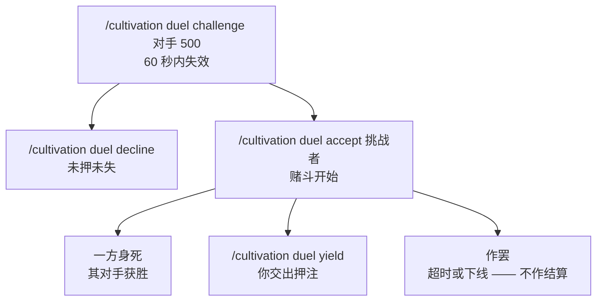

# 斗法

**赌斗**是两名修士之间你情我愿的一对一，以存蓄灵气为注。双方各自点头，败者将押注让与胜者，而这笔转移严格守恒 —— 分毫不会凭空生出。

受 `Duels-Enabled`（默认 `true`）管辖。

## 邀约与应战

- `/cultivation duel challenge <玩家> [押注]` 押上你相应数额的存蓄灵气，并向对方发起赌斗。完全省略押注，便是一场**不带彩头的意气之争**。但若填的不是整数，这次挑战会被**直接驳回**，而不再悄悄按 0 处理 —— 于是把 `100` 敲成 `1O0` 时它会告诉你，而不是让你以为押了一百灵气。负数押注同样拒绝。
- 邀约无人应答时，**60 秒**后失效（`Duel-Challenge-Expiry-Seconds`）。
- `Duel-Max-Wager` 为押注封顶。它**默认为 0，即不设上限**；任何正值都是一道天花板，超过它的邀约会被回绝。
- `/cultivation duel accept <玩家>` 接受该玩家未决的邀约，赌斗随即开始。双方都会被告知彩头几何。
- `/cultivation duel decline <玩家>` 将邀约丢弃。
- 两名玩家都不能身处另一场赌斗之中 —— 双方各自同时只能有一场。

赌斗**绝不存档**。服务器一旦重启，进行中的一切尽数作罢。

## 胜负如何判定

赌斗以三种方式之一结束。

**因死而定。** 赌斗是由一方**身死**来判定的，而非由谁下的手。无论最后一击是对手自己落下的、是他的[灵兽](/zh/beasts/)落下的、是第三方插手，还是败者不过是自己淹死了，胜利都归对手。判定得再窄一分，就会留下永远无法了结的赌斗。

**因认输而定。** `/cultivation duel yield`（别名 `forfeit`）立刻终结赌斗，并将押注付给对手。

**作罢。** 当赌斗变得无从判定时，双方灵气分毫不动：

- 任一参与者下线。
- 赌斗超过 **600 秒**（`Duel-Max-Duration-Seconds`；填 `0` 则关闭此超时）。这是对付「转身就走、从不应战」之人的最后一道保险。

仍在线的那一方会被告知赌斗已经作罢。

## 结算

败者至多交出押注数额的存蓄灵气，而胜者所得**恰是败者实际交出的数额**。若败者拿不出全部彩头，胜者只收到确实存在的那一部分 —— 赌斗绝不会成为灵气的水龙头。结算之时若有参与者不在线，则跳过之；而既然被跳过的败者分文未失，胜者自然也分文未得。

灵气是从你的存蓄总额中划走的，并不触及你的境界与阶段。存蓄灵气用在何处，见[境界与阶段](/zh/realms/)。

## 禁 PvP 世界上的斗法

`Duel-Overrides-World-Pvp` 是 **v0.4.1 新增**，默认为 `true`。

通常，`IsPvpEnabled` 为 false 的世界会取消一切玩家之间的伤害，这会让赌斗只能靠认输来了结。既然赌斗是明确、双向、且押上彩头的同意，Cultivation 便把恰好那一份伤害重新放行 —— 且仅此一份：

- 只在两名赌斗者之间，且只在他们的赌斗进行期间。
- 只在能确证「世界 PvP 开关是该次伤害被取消的唯一理由」时。若那里的 PvP 其实是开着的，那么取消另有其因，便一概不动。
- 绝不穿透出生点保护、无敌、虚化、已然身死的玩家，或一个把玩家所受伤害整体关掉的世界。
- 被救回的这一击此后仍会流经 Cultivation 自己的全部伤害过滤器，因此境界缩放、[大道](/zh/dao/)转化、本命法宝与功法效果一切照常生效。

将其设为 `false`，世界的 PvP 规则便是绝对的 —— 那样的世界上，赌斗就只能靠 `/cultivation duel yield` 了结。

## 指令

<Panel title="指令">
  | 指令 | 说明 | 权限 |
  | --- | --- | --- |
  | `/cultivation duel challenge <玩家> [押注]` | 押上存蓄灵气，向另一名修士发起赌斗。 | `cultivation` |
  | `/cultivation duel accept <玩家>` | 接受该玩家未决的邀约。 | `cultivation` |
  | `/cultivation duel decline <玩家>` | 拒绝该玩家未决的邀约。 | `cultivation` |
  | `/cultivation duel yield` | 认输当前赌斗；押注归对手所有。 | `cultivation` |
</Panel>

`Duels-Enabled`、`Duel-Challenge-Expiry-Seconds`、`Duel-Max-Wager`、`Duel-Overrides-World-Pvp` 与 `Duel-Max-Duration-Seconds` 皆位于宗门社群配置之中 —— 完整字段参考见[宗门社群配置](/zh/config-society/)，模组的全部指令见[指令](/zh/commands/)页。修士之间动手的其他途径，见[宗门攻伐](/zh/wars/)与[宗门](/zh/sects/)。
