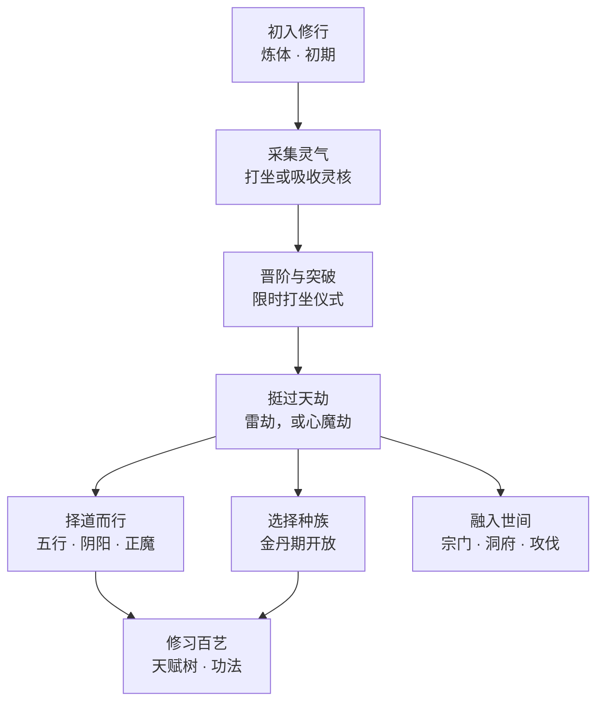

## 修真之路一览

每位修士的起步都相同 —— 采气、破境、渡劫 —— 而后才各自决定，要如何运用这条路所赋予的力量。

*起步之路，以及它的岔口*

<Divider />

## 各大体系

本模组由一系列彼此独立的体系叠加而成。你可以只保留境界阶梯， 也可以将以下功能尽数开启。

<CardGrid cols={3}>
  <CardLink href="/realms/" title="境界与阶段" han="境">
    七重境界，每重四个阶段。晋阶是常事，突破却是一场可能失败的仪式。
  </CardLink>

  <CardLink href="/qi-gathering/" title="聚灵采气" han="氣">
    打坐以汲取所在区块的灵脉，或猎杀生物以获取灵核、玄核与神核。
  </CardLink>

  <CardLink href="/tribulations/" title="天劫" han="劫">
    每次突破皆有雷劫落下。阴阳若偏执太甚，迎来的便是心魔劫。
  </CardLink>

  <CardLink href="/dao/" title="大道" han="道">
    十种元素之道，循五行相克之环；阴阳之衡随行止而动，终分正魔两途。
  </CardLink>

  <CardLink href="/techniques/" title="功法" han="術">
    自秘籍中习得的主动功法 —— 御剑飞行、一步千里、九天雷掌。
  </CardLink>

  <CardLink href="/sects/" title="宗门与攻伐" han="宗">
    开宗立派，于龙脉之上设立大殿，布下阵法，再以攻伐夺取敌宗山门。
  </CardLink>

  <CardLink href="/alchemy/" title="炼丹" han="丹">
    炼制丹药以稳固仪式、抵御心魔，或助你越过久攻不下的瓶颈。
  </CardLink>

  <CardLink href="/beasts/" title="灵兽" han="獸">
    驯服或孵化伴生灵兽，它们会随你一同修炼，充当守护、聚灵或警戒之职。
  </CardLink>

  <CardLink href="/profiles/" title="修炼存档" han="身">
    一个账号最多保留三名各自独立的修士 —— 从炼体重新起步，不必舍弃你花了一个月修成的元婴。
  </CardLink>

  <CardLink href="/auras/" title="修为气息" han="芒">
    境界之色的灵气自每名修士周身倾泻 —— 隔着一片原野，开口之前便读出对方的境界与阶段。
  </CardLink>

  <CardLink href="/titles/" title="称号" han="号">
    凭修行挣来的纯装饰称号，悬于头顶、缀于聊天，也随你登上排行榜与宗门名册。
  </CardLink>

  <CardLink href="/api/" title="开放接口" han="匠">
    144 个事件、十一个子系统、开放注册表，以及可让其他模组彻底替换修炼体系的接口。
  </CardLink>
</CardGrid>

<Divider />

## 七重境界

所有玩家皆自炼体初期起步。每重境界都会叠加生命上限与百分比伤害加成， 因此凡人与炼虚修士之间，差距犹如天堑。

體

炼体

凡人皆由此始 —— 先淬炼皮肉筋骨，而后方能纳气。

第一重

氣

炼气

天地灵气初次汇入体内，并能长驻不散。

第二重

築

筑基

道基既成，修为不再因一时闪失而倒退。

第三重

丹

金丹

金丹凝结。种族之选，于此开启，仅有一次。

第四重

嬰

元婴

元神化婴，可离体而行。

第五重

神

化神

神魂与躯壳相融，已非纯粹凡人之躯。

第六重

虛

炼虚

凡尘再难承载之前的最后一重境界。

第七重

[完整境界机制 →](/realms/)

<Divider />

## 由此开始

<CardGrid cols={2}>
  <CardLink href="/getting-started/" title="安装与起步">
    把 jar 放进正确的目录，然后度过你的第一个小时：打坐、吸核，直至踏入炼气期。
  </CardLink>

  <CardLink href="/qi-gathering/" title="灵气究竟如何运作">
    灵脉、脉品、聚气符、灵核掉率，以及为何死守一个区块终将无以为继。
  </CardLink>

  <CardLink href="/commands/" title="全部指令">
    The full `/cultivation` and `/sect` trees, their aliases, arguments and permissions.
  </CardLink>

  <CardLink href="/config/" title="服务端配置">
    Every tunable value in the mod, grouped by file — and how to edit them live without touching JSON.
  </CardLink>
</CardGrid>

<Panel title="速查表">
  | 指令 | 作用 |
  | --- | --- |
  | `/cultivation` | 打开你的修炼面板 |
  | `/cultivation meditate` | 就地打坐，汲取区块灵脉中的灵气 |
  | `/cultivation hud` | 开关常驻的角落信息面板 |
  | `/cultivation race` | 打开种族菜单（金丹期及以上） |
  | `/cultivation admin` | 游戏内实时配置编辑器 <Chip>管理员</Chip> |

  Aliases: `/cult` and `/qi` both work anywhere `/cultivation` does.
</Panel>
