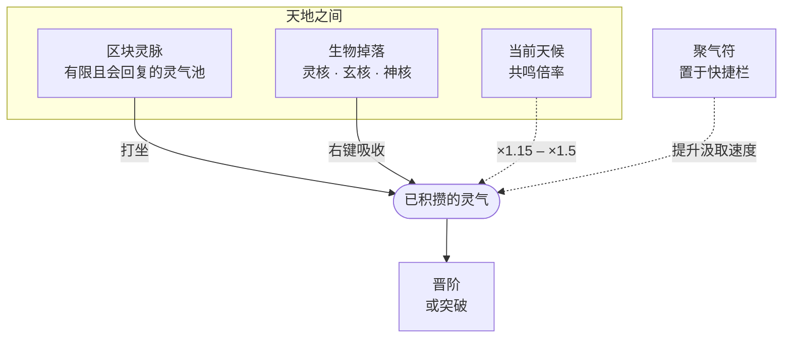

# 聚灵采气

灵气是整个模组的通货 —— 每一次晋阶与突破都由它买单。 获取途径有二，而它们刻意被设计成「并用远胜单取」。

*所有汇入灵气池的来源*

## 打坐与灵脉

`/cultivation meditate` 会让角色盘膝而坐，缓缓汲取所在区块**灵脉**中的灵气。 灵脉是实实在在的每区块灵气池：有容量上限，被汲取则减少，并随时间回复。 长踞一处终会将其抽干，届时每秒所得也随之下滑。

<Note kind="tip" title="勤挪窝">
  灵脉是就地消耗、各自回复的，因此最快的做法是在几处好区块之间轮换，而非死守一地。 用 `/cultivation debug vein` 可查看当前区块的余量。
</Note>

### 大地有了形状

灵脉的强弱并非每区块各掷一次，而是铺陈为一片**山川**：灵气在天地间如地势般起伏，相邻区块连成坡与脊，约每八个区块起伏一回。朝一个方向走去它便渐盛，折返则渐衰。

正因如此，这片土地才值得一读。一路行来所见是 `459 → 432 → 445 → 428 → 409 → 369` —— 一道你能顺着走的坡 —— 而非每区块独立掷出的 `417 → 175 → 216 → 324`，那时唯一的策略只是不停地跳，碰运气。

<Note title="顺着灵气上行，你终会抵达某处">
  灵脉与龙脉**聚成灵秀之地**，而非均匀散落，故寻得一处便有理由搜遍四周。其稀有度未变 —— 仍是配置所定的几率，只是重新分布到了灵气充沛之处。[灵气感知](/zh/spirit-sense/)让你不必亲自走遍，也能读出这道坡。
</Note>

予服主：`Spirit-Vein-Terrain-Jitter-Percent`（默认 6）是单个区块可偏离该曲面的幅度，以其品阶区间的百分比计。取几个百分点可使数字不至于过于工整；取值过大则会重现从前那片尖锐跳动的旧貌。已有的世界**保留既已生成的灵脉** —— 只有无人踏足之地才按新法铺陈。

### 脉品

并非所有区块生而平等。多数为凡脉，少数更为丰沛，而极稀有者坐拥龙脉 —— 那是值得为之开战的土地。

<CardGrid cols={3}>
  <Card title="凡脉" han="凡">
    基准脉品，以标准速度回复。
  </Card>

  <Card title="灵脉（丰沛）" han="灵">
    回复倍率明显更高，值得反复造访。
  </Card>

  <Card title="龙脉" han="龙">
    世间最佳之地。宗门大殿与洞府皆需依此而建。
  </Card>
</CardGrid>

<Note kind="warn" title="服主须知：抽取铁律">
  灵脉的回复速度乘以脉品倍率，必须**低于**打坐的抽取速度。 一旦「回复 × 倍率」超过抽取，该区块便成了取之不尽的灵气泉眼，整条成长曲线随即失去意义。
</Note>

### 灵气从何而来

打坐并不会把你所坐的那一格掏空。汲取是**分摊在五个区块上**的：脚下那一个出一半，四周各出八分之一。

<CardGrid cols={3}>
  <Card title="五成 —— 脚下" han="中">
    你所坐的区块独自承担一半的汲取。
  </Card>

  <Card title="各一成二五 —— 四邻" han="四">
    东南西北各出八分之一。
  </Card>

  <Card title="该挪个地方了" han="移">
    供不足的那一份便不再汲取 —— 它不会转嫁给其余各方。
  </Card>
</CardGrid>

你的*速率*并不因此改变 —— 变的只是来处。但常坐之地不再把脚下一格掏空而四邻满盈，一处所得如今取决于整片邻域，而非单一区块。若四周皆已枯竭，你便只得中间那一半。

[灵脉汲取范围](/zh/skilltree/)天赋会延长这四条脉络，使最近区块已然枯竭的那一条向外探得更远，去取*它自己*的那一份。它并非增产之法 —— 而是让高阶修士在已被采尽的地界仍能维持全速。

### 聚气符

打坐时只要**聚气符**在快捷栏中，灵脉汲取速度便会提升 —— 无需握在手中，携带即可。 其倍率与行为在 `SpiritVeinConfig.json` 中设定。

## 修炼之核

击杀生物有几率掉落修炼之核。右键即可吸收，立刻转化为一笔灵气，无需打坐 —— 这让你在做别的事情时也能推进修为。

| 核 | 稀有度 | 定位 |
| --- | --- | --- |
| <Chip>灵核</Chip> | 常见 | 日常掉落，灵气少而稳。 |
| <Chip>玄核</Chip> | 罕见 | 可观的一笔，值得留到仪式前。 |
| <Chip>神核</Chip> | 稀有 | 足以凭一己之力推完一次难缠的突破。 |

<Note kind="tip" title="两法并用">
  在*打坐途中*吸核，可在其原本灵气之上额外获得加成。 与其见核就吸，不如攒起来留到打坐时一并消化。
</Note>

三种核的掉率与灵气值皆位于 `SpiritCoreConfig.json`。

## 天候共鸣

天时亦有讲究。打坐时若逢天候变化，可获灵气倍率；若该天候与你所修之**道**的元素相合，倍率更高。

| 情形 | 倍率 |
| --- | --- |
| 天候与所选道之元素相合 | **×1.5** |
| 其他任意天候 | **×1.15** |
| 晴空无云 | ×1.0 |

天候与元素的对应关系亦可按关键词在 `DaoConfig.json` 中配置。

## 融会贯通

前期高效的循环大致如下：

1. 先行狩猎，攒下若干核与一枚聚气符。
2. 用 `/cultivation debug vein` 找一处丰沛区块坐下。
3. 若有天候便趁势打坐 —— 落雨远胜晴空。
4. 在打坐*途中*吸收存下的核，吃满叠加加成。
5. 灵脉转薄时挪开数个区块，如此往复。
