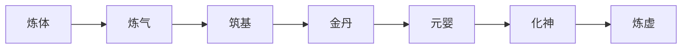
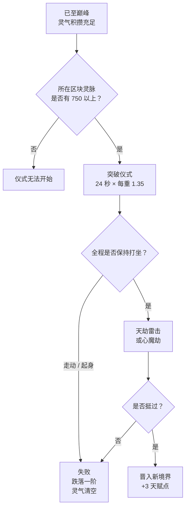

# 境界与阶段

所有玩家皆自**炼体·初期**起步，历经**七重境界**迈向长生， 每重境界又分**四个阶段**：初期、中期、后期、巅峰 —— 全程共二十八级。

*七重境界，依次而上*

## 境界阶梯

在每重境界内依**初期 → 中期 → 后期 → 巅峰**逐级晋阶， 而后**突破**至下一境界的初期。境界与阶段越高，生命上限加成与 百分比伤害加成越多，二者皆在 `Config.json` 中可调。

体

炼体

淬炼皮肉筋骨，为纳气打下根基。

第一重

气

炼气

天地灵气终于能汇入体内并长驻。

第二重

基

筑基

道基既成，此后攀登虽陡，却不再脆弱。

第三重

丹

金丹

丹田结丹 —— 一生仅有一次的种族之选于此开启。

第四重

婴

元婴

元神化婴，可短暂离体而行。

第五重

神

化神

神魂与躯壳相融，凡尘已难辨其形。

第六重

虚

炼虚

本模组所载的最后一重，亦是凡世所能承载的极限。

第七重

## 晋阶与突破

两者都是**限时的打坐仪式**。先积攒足够的[灵气](/zh/qi-gathering/)， 再在灵脉充沛的区块坐下，只要持续打坐，仪式便会推进。

区块灵气是一道**门槛检定，而非消耗** —— 仪式不会抽干灵脉； 但灵脉一旦跌破门槛，仪式会暂停，直到灵气回升。

|  | 阶段晋阶 | 境界突破 |
| --- | --- | --- |
| **触发时机** | 初期 → 中期 → 后期 → 巅峰 | 巅峰 → 下一境界初期 |
| **区块灵气门槛** | 200 `Advancement-Min-Chunk-Qi` | 750 `Breakthrough-Min-Chunk-Qi` |
| **基础时长** | 8 秒 `Advancement-Base-Seconds` | 24 秒 `Breakthrough-Base-Seconds` |
| **时长倍率** | 每重境界 ×1.3 | 每重境界 ×1.35 |
| **天劫雷击** | <Chip>默认关闭</Chip> | <Chip>默认开启，且致命</Chip> |
| **天赋点** | +1 `Points-Per-Advancement` | +1，另加 2 点 `Points-Per-Breakthrough` |

<Note kind="warn" title="失败必有代价">
  中断仪式 —— 无论是走离原地，还是手动起身 —— 都会**使你跌落一个阶段**， 清空已积攒的灵气，并收回该阶段所授予的天赋点。但你永远不会跌破*当前*境界的初期， 因此一次失败的突破绝不会让你损失整整一重境界。
</Note>

## 仪式流程

*一次突破尝试的完整流程*

<Note title="天道在上">
  突破雷劫确有致命之力 —— 残血之下足以当场毙命。 阴阳偏执过甚的修士，迎来的将是**心魔劫**：所考验的不是气血，而是**道心**。 两者皆可调节，且晋阶天劫默认关闭。
</Note>

## 调整曲线

此处并无任何写死的数值。境界曲线与其属性奖励位于 `Config.json`， 上述仪式要求则位于 `BreakthroughConfig.json`。 两者都可通过 `/cultivation admin` 在游戏内实时修改，无需改文件、无需重启。
