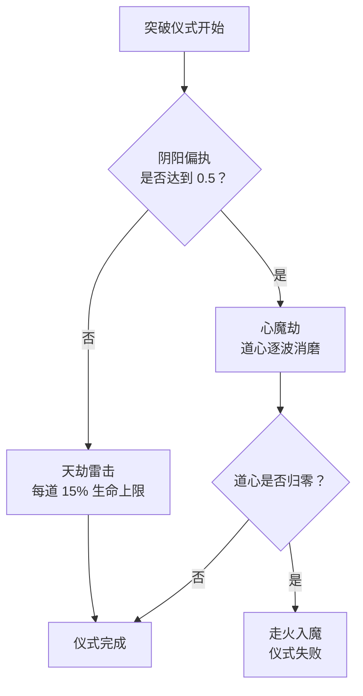

# 天劫

天道不会让你安然飞升。境界突破会引来**天劫雷击**，落在正端坐渡劫的修士身上 —— 而心性偏执入魔或过于极端者，迎来的是更可怕的东西。

天劫默认开启（`Tribulation-Enabled`），且默认**致命**（`Tribulation-Lethal`）。一次突破真的能要你的命。

<Divider />

## 天劫雷击

| 配置项 | 默认值 | 说明 |
| --- | --- | --- |
| `Tribulation-Strike-Interval-Seconds` | 6 | 每隔多少秒的**仪式进度**落下一道雷。 |
| `Tribulation-Damage-Percent-Of-Max-Health` | 15 | 每道雷的伤害，按生命上限的百分比计。 |
| `Tribulation-Damage-Realm-Multiplier` | 1.12 | 每提升一重境界的伤害倍率。 |
| `Tribulation-Lethal` | true | 设为 false 时，雷击永远会给你留下一丝血，不会直接致死。 |

雷击依**仪式进度**而落，与现实时间无关 —— 因区块灵脉不足而暂停的仪式绝不会挨雷。按默认值，一次 24 秒的首次突破会引下四道雷；境界越高、仪式越长，雷数也按比例增加。

伤害走的是通常的伤害管线，因此你身上的一切防护都有效：[本命护甲](/zh/lifebound/)、[天赋树](/zh/skilltree/)的减伤、金刚不坏、护体真气，以及守护型[灵兽](/zh/beasts/)。

**挺过一道雷是有回报的。** 每挺过一击都会为你掷一次[功法秘籍](/zh/manuals/)掉落（`Manual-Tribulation-Drop-Chance`，4%）与一次灵石掉落，并消去部分[业力](/zh/karma/)。判定在伤害完全结算后的下一个打坐周期进行 —— 站着的那个就是幸存者。

## 晋阶天劫

阶段晋阶同样可以引雷，但此功能**默认关闭**：

| 配置项 | 默认值 | 说明 |
| --- | --- | --- |
| `Advancement-Tribulation-Enabled` | false | 开启后，阶段晋阶也将变得凶险。 |
| `Advancement-Tribulation-Damage-Percent-Of-Max-Health` | 6 | 每道雷的伤害，仅为突破天劫的一小部分。 |

间隔、境界倍率与致命规则均与突破共用，唯有伤害百分比不同。

## 业力使其更重

身负[业力](/zh/karma/)的修士，所面对的雷更深、更密，二者皆随业力多寡线性递增。额外的雷会被压进**同样长度的仪式**之中 —— 因此背负业力的突破不会更久，只会更凶。

## 渡劫符（丹）

一枚[渡劫丹](/zh/alchemy/)的存量可完全抵消一道雷的伤害。雷仍会落下 —— 声光如常 —— 只是伤不到你。最多可同时存有三次，且在用掉之前一直保留。

<Divider />

## 心魔劫

阴阳偏执较强的一侧达到 `HeartDevil-Lean-Threshold`（0.5）的修士，根本不会遇到雷劫。天道送来的是**心魔**。此机制默认开启（`HeartDevil-Enabled`），且仅作用于突破，除非开启 `HeartDevil-On-Advancement`。

心魔劫所攻的不是气血，而是你的**道心** —— 一个在每次尝试开始时重新蓄满的池子，并会在心魔劫期间显示于面板上。

| 配置项 | 默认值 | 说明 |
| --- | --- | --- |
| `HeartDevil-Lean-Threshold` | 0.5 | 达到该偏执值后，雷劫将被心魔劫取代。 |
| `HeartDevil-Max-Composure` | 100 | 每次尝试的道心池上限。 |
| `HeartDevil-Composure-Drain-Per-Pulse` | 34 | 每一波所消磨的道心，按 `0.5 + 偏执值` 缩放。 |
| `HeartDevil-Debuff-Effect` | Stun | 每一波所施加的实体效果。 |
| `HeartDevil-Debuff-Duration-Seconds` | 1.5 | 该效果的持续时间。 |

心魔的波次与雷击同频。消磨量随偏执程度递增：刚好卡在门槛上的修士每波约失 34 点道心，而彻底偏执者约失 51 点 —— 心性染得越深，能撑的波数越少。道心池按次重置，因此一次失败不会把损伤带进下一次。

## 走火入魔

道心一旦归零，仪式即告失败，你将**走火入魔**，并以屏幕标题昭告。

| 配置项 | 默认值 | 说明 |
| --- | --- | --- |
| `HeartDevil-Deviation-Demotes` | true | 你将跌落一个阶段。 |
| `HeartDevil-Deviation-Qi-Loss-Percent` | 100 | 关闭跌阶时改用此项 —— 所损失的已积攒灵气百分比。 |

无论哪种方式，仪式都就此终结。按默认设置，心志崩溃者会跌落一阶，与中途起身离开无异。

## 清心丹

一枚[清心丹](/zh/alchemy/)的存量可护住道心，让其中一波毫无消磨：心魔照旧现形，但那一波不伤分毫。同样最多三次，用尽为止。这是此处唯一有用的防护 —— 渡劫丹挡的是雷，而偏执的修士根本不会遇到雷。

<Divider />

## 如何渡过

显而易见的办法就是正确的办法：备好丹药；用清心丹或和缓分支的仪式速度节点缩短仪式，好让波数更少；叠加受到伤害的减免；并在坐下之前先了结你的[业力](/zh/karma/)。把阴阳之衡拉回中位，则可彻底避开心魔劫这条线 —— 详见[大道](/zh/dao/)。

[炼器](/zh/refinement/)会以同样的间隔引来自己的天劫，伤害较缓，为生命上限的 10%，但只要 `Tribulation-Lethal` 开启，它同样能致命。

本页所有数值均位于突破配置之中，与仪式时长并列 —— 详见[配置](/zh/config-cultivation/) —— 相关指令则见[指令](/zh/commands/)页面。
