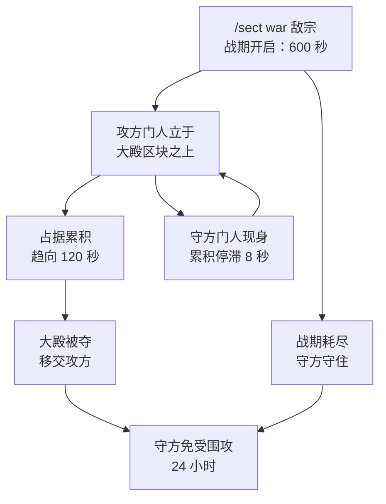

# 宗门攻伐

**宗门之战**只有一件事：围攻敌对[宗门](/zh/sects/)已占的大殿。没有积分、没有击杀数、没有据点 —— 攻方宗门只需在战期耗尽之前，无人争夺地在那块争议区块上站够时候。胜则大殿易主。

整个系统受 `Wars-Enabled`（默认 `true`）管辖。

## 宣战

`/sect war <宗门>` 向该宗门的大殿发起围攻。唯有本宗**宗主**可以宣战。以下情形宣战遭拒：

| 回绝 | 缘由 |
| --- | --- |
| 同一宗门 | 你无法围攻自己。 |
| 目标并无大殿 | 无物可夺。大殿如何设立，见[宗门](/zh/sects/)。 |
| 目标已在被围攻 | 同一守方一次只受一场围攻。 |
| 你已在攻伐他人 | 同一攻方一次只发一场围攻。 |
| 目标尚在冷却 | 他们的上一场战事结束得太近 —— 见下文。 |
| 目标宗门无人在线 | 离线保护，`War-Requires-Defender-Online`（默认 `true`）。 |

任何战期已然耗尽的围攻，都会在上述检查之前被清扫并判为失败，因此一场被遗忘的围攻绝不会把任何一方锁死在宣战之外。

宣战成功时，两宗同时收到告知 —— 攻方得知围攻已开，守方得知自家山头正受威胁。

## 围攻

其背后的规则，皆由配置驱动：

- 围攻自宣战起开启 **600 秒**（`War-Window-Seconds`）。在此战期内达到所需占据时长即夺下大殿；战期耗尽则围攻失败。
- 累积 **120 秒**的占据即可夺取（`War-Required-Hold-Seconds`）。
- 在场情况每 2 秒采样一次。唯有**攻方**宗门的门人立于大殿自身的区块之上时，占据才会累积；且任何单次采样至多计入 5 秒真实时间 —— 因此一段无人在场的空档，绝不会被追溯计入。
- 该区块上一旦见到**守方**宗门的门人，此后 **8 秒**内累积停滞（`War-Defender-Grace-Seconds`）。守方不必杀人；人在那里，就足以守住阵线。
- 双方都在世界原本的 PvP 规则之下厮杀。守方自家的[阵法](/zh/formations/)在此大有助益：护山大阵扼制外人在自家地界上的灵气恢复，而困仙阵则直接定住并伤及入侵者。

围攻是存档的。围攻中途重启，会以剩余时间续上，而不是白送守方一场胜利；占据进度至少每 15 秒落盘一次。若战期是在服务器停机期间耗尽的，则视作它已走完全程 —— 守方照样获得战后的免战。

## 冷却

无论围攻以何种方式结束 —— 被夺、逾期，或守方的大殿在占据完成前就已不存 —— **守方宗门**都会在 **24 小时**真实时间内免受再次围攻（`War-Cooldown-Hours`）。攻方自身不背冷却，但在第一场围攻仍在进行时，他们无法发起第二场。

## `/sect war status`

裸写 `/sect war` 与 `/sect war status` 都会回报以下内容 —— 且**任何一名**门人都可查询，不限于宗主：

- 本宗是在攻还是在守，对手是谁。
- 迄今累积的占据时长，与所需时长之比。
- 战期剩余秒数。
- 守方当前是否正在争夺该区块，好让攻方明白自己的占据为何停滞不前。

若无围攻在进行，它会如实相告，并在本宗确有战事冷却时补上剩余的时与分。查询状态同时也会清扫掉一场战期已悄然耗尽的围攻。

## 胜者所得

占据完成时，守方的大殿 —— 那个确切的区块及其灵脉阶位 —— 移交攻方宗门，守方就此无殿。这一次移交带走的东西可不少：

- 大殿所支付的**宗门灵气加成**（丰灵脉 +5%，龙脉 +8%）转归胜者。败者则彻底失去它，直到另占新地。
- 大殿共享的**灵泉**，连同其中所蓄的一切，会在下一次扫描时随地界归于胜者。见[洞府](/zh/dwelling/)。
- 败者的**殿上碑文**就此熄灭。大殿一去，其所授之法立刻从他们每一名门人处收回。碑文本身不会被夺 —— 它仍记录在败方宗门之上，他们日后若另立新殿便会重新授法；而胜者自己的碑文分毫未动。
- [阵法](/zh/formations/)**不会**易主。无论坐落何处，它们始终由布下它们的宗门掌控。

若守方宗门在占据完成之前就解散、或放弃了大殿，那便无物可夺：围攻转判失败，攻方至少能得知它已经结束。

## 指令

<Panel title="指令">
  | 指令 | 说明 | 权限 |
  | --- | --- | --- |
  | `/sect war <宗门>` | 向该宗门的大殿发起围攻（仅宗主）。 | `cultivation.sect` |
  | `/sect war status` | 回报本宗所处的围攻，或本宗的战事冷却。 | `cultivation.sect` |
  | `/sect claim` | 设立或迁移大殿 —— 围攻所争夺的正是它。 | `cultivation.sect` |
</Panel>

`Wars-Enabled`、`War-Required-Hold-Seconds`、`War-Window-Seconds`、`War-Defender-Grace-Seconds`、`War-Cooldown-Hours` 与 `War-Requires-Defender-Online` 皆位于宗门社群配置之中 —— 完整参考见[宗门社群配置](/zh/config-society/)，模组的全部指令见[指令](/zh/commands/)页。
