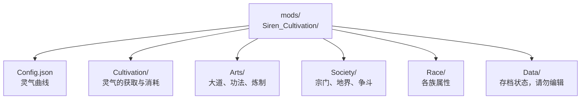

### 配置总览

Cultivation 模组一切可调之处，皆位于 `mods/Siren_Cultivation/` 之下，本页对应 **Cultivation v0.6.2**。这些设置并非挤在一个巨大的文件里，而是拆成若干主题文件、再归入文件夹 —— 进阶核心在 `Cultivation/`，修士所修习的一切在 `Arts/`，唯因他人存在才有意义的一切在 `Society/`，每个可选种族一份文件在 `Race/`，服务器自身的运行期存档状态则在 `Data/`。

每份设置文件都带有自己的 `ConfigName` 与 `ConfigVersion`。每当该文件的结构或数值平衡发生变化，版本号会自动递增，而你已有的设置会被自动迁移 —— 你从不需要手动编辑 `ConfigVersion`，把它改小也只会让迁移再跑一遍。文件中还含有 `Description-*` 字符串字段，那是文档而非设置：模组会在加载时把它们改写回当前文本，因此编辑它们毫无作用。

这些页面上的每一个数值，也都可以用 `/cultivation admin` 在游戏中实时更改，全然不必碰 JSON。如何抵达该界面，见[指令](/cultivation/commands/)与[权限](/cultivation/permissions/)两页。

自 0.5.0 起，其他模组可以把**自己的**分节加入该编辑器，与 Cultivation 自身的九个分节并列显示在配置页中，以及设置菜单里一块仅管理员可见的区域内。你在那里看到的、本站页面未曾记载的任何内容，都属于另一个模组 —— 见[编写扩展](/cultivation/api/addons/)。

#### 文件夹分组

| 分组 | 文件 | 涵盖 |
|:---|:---|:---|
| [核心配置](/cultivation/config/core/) | `Config.json` | 灵气曲线，以及每级的生命／伤害加成。 |
| [修炼配置](/cultivation/config/cultivation/) | `SpiritCoreConfig`、`SpiritVeinConfig`、`BreakthroughConfig`、`RaceSystemConfig`、`SkillTreeConfig` | 灵气从何而来、进阶要付出什么，以及升一级能得到什么。 |
| [功法配置](/cultivation/config/arts/) | `DaoConfig`、`TechniqueConfig`、`ManualConfig`、`AlchemyConfig`、`RefinementConfig`、`LifeBoundConfig`、`BeastConfig` | 修士所修习、所炼制、所淬炼、所认主之物。 |
| [宗门社群配置](/cultivation/config/society/) | `SectConfig`、`FormationConfig`、`DwellingConfig`、`WarConfig`、`DuelConfig` | 宗门、他们所据的土地、所建的居所，以及所挑起的争斗。 |
| [种族配置](/cultivation/config/race/) | `Human.json`、`Demon.json`、`Deity.json` | 每个可选种族一份独立的属性文件。 |
| [存档文件](/cultivation/config/data/) | `SectsData`、`FormationsData`、`WarsData`、`DwellingsData`、`LeaderboardData` | 运行期存档状态。这些不是设置 —— 请勿手动编辑。 |

#### 目录结构

```
mods/Siren_Cultivation/
├── Config.json
├── Cultivation/
│   ├── SpiritCoreConfig.json
│   ├── SpiritVeinConfig.json
│   ├── BreakthroughConfig.json
│   ├── RaceSystemConfig.json
│   └── SkillTreeConfig.json
├── Arts/
│   ├── DaoConfig.json
│   ├── TechniqueConfig.json
│   ├── ManualConfig.json
│   ├── AlchemyConfig.json
│   ├── RefinementConfig.json
│   ├── LifeBoundConfig.json
│   └── BeastConfig.json
├── Society/
│   ├── SectConfig.json
│   ├── FormationConfig.json
│   ├── DwellingConfig.json
│   ├── WarConfig.json
│   └── DuelConfig.json
├── Race/
│   ├── Human.json
│   ├── Demon.json
│   └── Deity.json
└── Data/
    ├── SectsData.json
    ├── FormationsData.json
    ├── WarsData.json
    ├── DwellingsData.json
    └── LeaderboardData.json
```

#### 从何处着手


