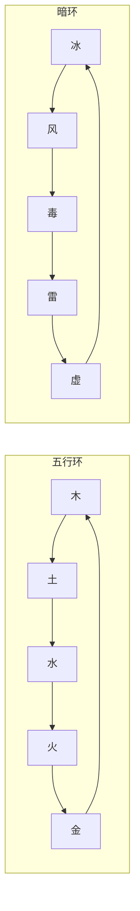

### 大道

用 `/cultivation dao` 打开你的大道页面。其中并行着两条轨迹：由你**主动择定**的元素之道（五行道），以及由你的行止**悄然写就**的阴阳之衡。

元素这一半在**筑基**期解锁（`Dao-Unlock-Realm`），首次选择免费。阴阳这一半自始便已生效，除非服务端开启了 `YinYang-Endgame-Only` —— 那会将其隐藏并暂停，直到 `YinYang-Unlock-Realm`（元婴期）。

* * *

#### 十种元素

五种经典五行构成一环，五种幽暗元素另成一环。每种元素**克制**其所在环中的下一位，循环往复。**跨环相遇则互不克制** —— 火修对毒修并无任何元素上的优劣。

箭头读作「克」。木克土，土克水，如此绕环一周；冰克风，风克毒，暗环亦然。

每种元素都对应一种真实的伤害类型。火、冰、毒沿用原版伤害源；木、土、水、金、风、雷、虚则是本模组自带的伤害资产，均继承引擎的元素伤害类别。

* * *

#### 伤害转化与相克

一旦踏上某道，你的近战输出便会转化为该元素的伤害类型，并作如下调整：

| 配置项 | 默认值 | 说明 |
|:---|:---|:---|
| `Dao-Damage-Bonus-Percent` | 10 | 任何已转化攻击的固定加成。 |
| `Dao-Counter-Bonus-Percent` | 15 | 对元素被你克制的目标，额外伤害。 |
| `Dao-Counter-Penalty-Percent` | 10 | 对克制你的元素，伤害降低。 |
| `Dao-Wood-Heal-Percent-Of-Damage` | 20 | 木之道用以替代固定加成的效果。 |

**木是疗愈之道。** 它完全没有固定伤害加成 —— 取而代之的是，你所造成伤害的 20% 会转化为对自身的治疗。相克加成仍照常生效。

尚未择道的修士也并未被冷落：一件[炼制过的兵器](/cultivation/refinement/)会自行提供元素以参与转化与相克；而当该元素与持有者自身的道相合时，还会额外附加一层共鸣加成。造成伤害的[功法](/cultivation/techniques/)同样流经这一层过滤，因此剑气斩与九天雷掌会免费染上你的道之色彩。

#### 换道与偏移

主动换道需消耗已积攒的灵气，并遵守一段真实时间的冷却：

| 配置项 | 默认值 | 说明 |
|:---|:---|:---|
| `Dao-Switch-Base-Qi-Cost` | 500 | 换道的基础灵气消耗。 |
| `Dao-Switch-Qi-Cost-Realm-Multiplier` | 1.6 | 每提升一重境界的倍率。 |
| `Dao-Switch-Cooldown-Hours` | 24 | 两次主动换道之间的真实小时数。 |

你的道也可能**自行偏移**。每一次元素击杀都会为致命一击所属元素的隐藏亲和度累加 `Dao-Affinity-Per-Elemental-Kill`（1），你的种族倾向亦会为其添砖加瓦。当另一种元素的亲和度超出你所择之道 `Dao-Drift-Margin`（25）时，你会收到警告；若继续增长至该阈值的两倍，你的道便会自行转换 —— 不耗灵气，也无冷却。将 `Dao-Drift-Enabled` 设为 false 可将道固定为纯粹的主动抉择。

* * *

#### 阴阳之衡

每位修士都背负着一条随行止而动的阴阳之衡：

- **打坐**每个汲取周期使其偏移 `Meditation-Alignment-Shift-Per-Tick`（0.2）—— 在良善区块偏向阳，在邪秽区块偏向阴。约 5% 的区块（`Chunk-Evil-Qi-Chance`）承载着邪气。
- **你的种族**会以自身的 `Qi-Alignment-Yin-Bias-Percent` 扭曲这一偏移 —— 魔族的 +50% 连良善之气也会染黑，神族的 -30% 则涤净暗气。详见[种族](/cultivation/races/)。
- **杀戮**每次增加 `Kill-Yin-Amount`（1）点阴；当世界处于夜晚阶段时，再乘以 `Night-Kill-Yin-Multiplier`（2）。**暗夜屠戮，染得最深。**

你在这条标尺上的位置决定你所得为何：

| 状态 | 效果 |
|:---|:---|
| 平衡 —— 处于 50/50 中位的 `Balance-Window-Percent`（15%）以内 | 对**所有**灵气获取与伤害提供 `Balance-Bonus-Percent`（10%）加成，并向窗口边缘线性衰减。 |
| 深阴 —— 阴占比越过 `Lean-Threshold-Percent`（70%） | `Yin-Power-Damage-Percent`（+10%）伤害，以及 `Yin-Lifedrain-Percent`（5%）的伤害转化为生命。 |
| 深阳 —— 阳占比越过同一阈值 | `Yang-Defense-Percent`（10%）受伤减免，以及 `Yang-Heal-Bonus-Percent`（+25%）的受治疗增幅（含木之攻击）。 |

平衡与偏执在构造上互斥：你不可能既完美居中，又深度偏向一端。**在两者之间取舍，才是这套体系真正的抉择。**

* * *

#### 正魔两途

偏得足够深，阴阳之衡便不再只是一项属性，而成为一条**道途**。道途从不由你选择 —— 它追随你的作为，也随之回摆。你的大道页面会显示当前所行之途，变更时亦会在聊天栏告知。

| 道途 | 触发条件 | 增益 |
|:---|:---|:---|
| **魔道** | 阴偏比例达到 `Path-Lean-Fraction-Threshold`（0.5） | 对正道修士 `Path-Devil-Damage-Vs-Righteous-Percent`（+15%）伤害；斩杀任意玩家掠夺 `Path-Devil-PK-Qi-Reward`（100）点灵气。 |
| **正道** | 阳偏比例达到同一阈值 | 对魔道修士 `Path-Righteous-Damage-Vs-Devil-Percent`（+15%）伤害，并 `Path-Righteous-Defense-Vs-Devil-Percent`（15%）减免其伤害。 |
| **无属** | 未越过阈值的一切情形 | 凡尘中道 —— 没有道途增益，但平衡加成在此最易维持。 |

魔道的灵气掠夺设有防刷限制：在 `Pk-Same-Victim-Cooldown-Seconds`（900 秒）内重复斩杀同一人分文不得，斩杀境界序号低于 `Pk-Min-Victim-Realm`（1）者亦然。这两道闸门同样覆盖大道功过与[秘籍](/cultivation/manuals/)掉落判定，而不只是灵气。寻常 PvP 不受影响 —— 被限制的只是修炼上的战利品。

一次刷杀不仅毫无回报：它所记下的[业力](/cultivation/karma/)比一次光明磊落的斩杀更重，而魔道修士积业本就快于常人。天道会在你下一次[渡劫](/cultivation/tribulations/)时前来清算。

任一方向的深度偏执，也会改变突破的模样：一旦越过 `HeartDevil-Lean-Threshold`（0.5），你所要面对的将是**心魔劫**，而非天劫雷击。

| 指令 | 说明 | 权限 |
|:---|:---|:---|
| `/cultivation dao` | 打开大道页面 —— 元素、亲和度、阴阳、道途与业力。 | `cultivation` |
| `/cultivation bonuses` | 当前作用于你的全部加成，含大道。 | `cultivation` |

本页所有数值均位于大道配置之中 —— 详见[功法配置](/cultivation/config/arts/)。
