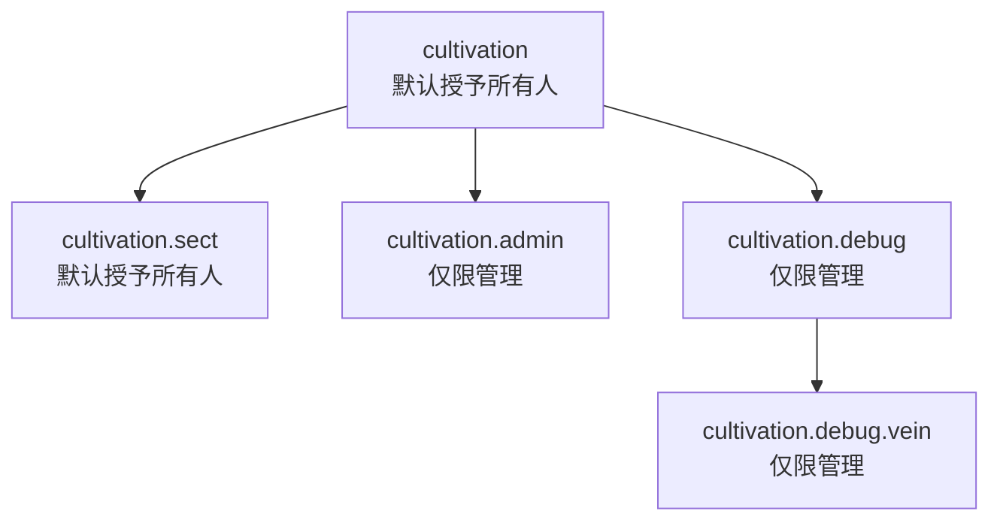

### 权限

模组声明了五个权限节点。模组中的每一条指令都归于其中之一 —— 哪条指令需要哪个节点，见[指令](/cultivation/commands/)。

| 权限 | 说明 |
|:---|:---|
| `cultivation` | `/cultivation` 根指令及其下每一条面向玩家的子指令 —— info、bind、meditate、hud、settings、race、skilltree、dao、technique、refine、respec、bonuses、formations、abode、beast、duel、top。 |
| `cultivation.sect` | `/sect` 根指令及每一条宗门子指令，含 `/sect war` 与 `/sect top`。经由 `/cultivation sect ...` 抵达的同一套指令，用的也是这个节点。 |
| `cultivation.admin` | `/cultivation admin` 配置编辑界面，及其全部八条会改动玩家的子指令。 |
| `cultivation.debug` | `/cultivation debug` 指令组。 |
| `cultivation.debug.vein` | `/cultivation debug vein`。 |

#### 层级

节点名以点分隔，而这层点分正映照着指令树 —— `cultivation` 是根，`cultivation.sect`、`cultivation.admin` 与 `cultivation.debug` 居于其下，`cultivation.debug.vein` 又居于 debug 组之下。每条指令都明确要求它自己的节点，因此持有 `cultivation` 本身并不附带 `cultivation.admin`。

#### 默认授予什么

`cultivation` 与 `cultivation.sect` 都注册到了 `hytale:None` 组 —— 即每位玩家默认所属的组 —— 因此整套面向玩家的体验，修炼与宗门一概在内，无需任何权限配置便开箱即用。

`cultivation.admin`、`cultivation.debug` 与 `cultivation.debug.vein` 默认不授予任何人。它们是被刻意注册为一份**空的**权限组列表，而非置之不理：未设置的列表会回退到父指令的权限组，那将经由 `hytale:None` 悄无声息地把管理菜单交到每位玩家手中。服务器管理人员仍按常规途径取得它们 —— 通过自己管理组上的通配符。
