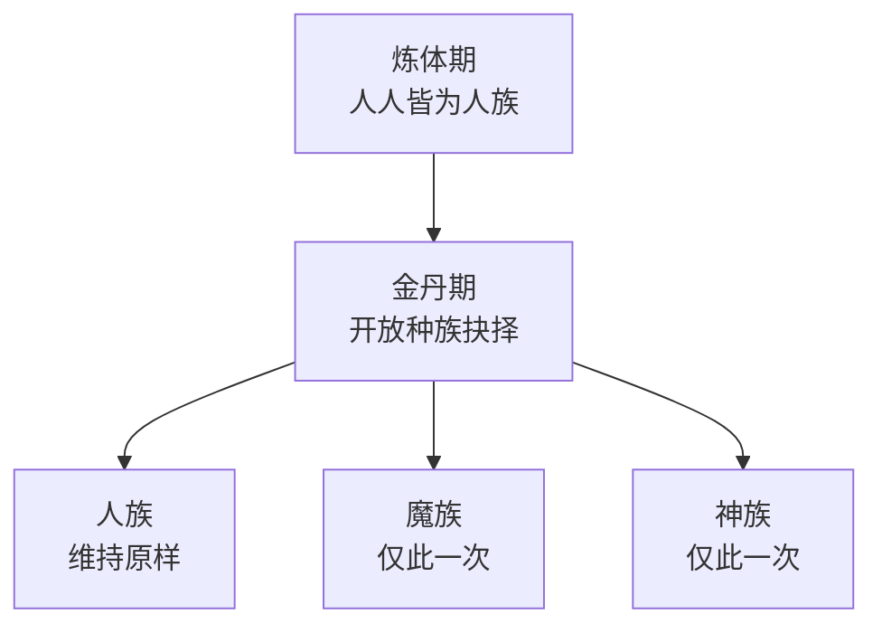

### 种族

所有玩家最初皆为**人族**。修至**金丹**期后，可一次性选择转为**魔族**或**神族**（亦可维持人族），通过专门的种族菜单（`/cultivation race`）作出抉择 —— 菜单会在你下决定之前，实时列出各族由配置驱动的加成。已经用掉了这唯一的机会？管理员可用 `/cultivation admin grantracechoice` 再赐一次。

每个种族都会赋予自己的生命上限、伤害、灵气获取速度与突破速度加成，以及所吸收灵气的**阴气偏向**。所有数值都可在不重新编译的前提下重新平衡，而游戏内显示的永远是当前生效的实时数值。

#### 可选种族

| 种族 | 解锁境界 | 生命 | 伤害 | 灵气获取 | 突破速度 | 阴气偏向 |
|:---|:---|:---|:---|:---|:---|:---|
| 人族 | 炼体 | +0% | +0% | +10% | +0% | 0% |
| 魔族 | 金丹 | -10% | +25% | -10% | +0% | +50% |
| 神族 | 金丹 | +20% | -10% | +5% | 快 20% | -30% |

**阴气偏向**（`Qi-Alignment-Yin-Bias-Percent`）决定你打坐所得的灵气如何落在阴阳之衡上：魔族的 +50% 会把本应化为阳的灵气中的一半转为阴，神族的 -30% 则将三成本应为阴的灵气涤为阳。这是推动你走向魔道或正道的最大单一因素 —— 详见[大道](/cultivation/dao/)。

默认情况下，管理员使用 `/cultivation admin setrace`（或管理菜单中的设置种族）可完全绕过该种族的解锁境界限制 —— 将 `Race-Admin-Bypasses-Realm-Gate` 设为 false，即可让管理员的指定同样受常规境界门槛约束。

#### 开放的注册表

种族已不再是一份封闭的名单。其他模组可通过 `CultivationAPI.registerRace` 注册一个全新的种族，其数据可来自自己的配置文件或一个普通常量，注册后便会与人族、魔族、神族并列出现在种族菜单中 —— 拥有各自的解锁境界、加成与阴气偏向。内置种族与第三方种族走的是完全相同的代码路径。具体做法见[注册表](/cultivation/api/registries/)。

| 指令 | 说明 | 权限 |
|:---|:---|:---|
| `/cultivation race` | 打开种族选择菜单。 | `cultivation` |
| `/cultivation admin setrace` | 强制设置某玩家的种族。 | `cultivation` |
| `/cultivation admin grantracechoice` | 为某玩家再赐一次种族抉择机会。 | `cultivation` |

各族自身的数值分别存放于一族一个的配置文件中 —— 见[种族配置](/cultivation/config/race/) —— 而跨种族的服务端行为位于 `Cultivation/RaceSystemConfig.json`，说明见[修炼配置](/cultivation/config/cultivation/)页面。

* * *

#### 人族

> 适应力强，悟性敏捷。战斗上并无极端之处，但灵气流转略为顺畅。

所有玩家皆自人族起步，并可在金丹期开放抉择时选择维持人族。这是均衡的通才之选 —— 没有任何战斗短板，且拥有三大内置种族中最高的原始灵气获取速度。

##### 加成

| 项目 | 数值 |
|:---|:---|
| 解锁境界 | 炼体（自始即可） |
| 生命上限 | +0% |
| 输出伤害 | +0% |
| 灵气获取速度 | +10% |
| 突破时长 | +0%（无变化） |
| 阴气偏向 | 0%（中立） |

中立的阴气偏向意味着人族打坐所得的灵气，完全按所在区块自身的属性落在阴阳之衡上，种族不会额外施加任何倾斜。这使人族成为最容易将阴阳维持在 50/50 附近的种族 —— 而那正是全面灵气与伤害加成之所在，详见[大道](/cultivation/dao/)。

#### 魔族

> 凶戾嗜战。战斗中悍勇无匹，但修炼手法粗野，聚气因此迟缓。

魔族是偏战斗的选择，需修至金丹期方可解锁。它以一部分生命上限与明显更慢的灵气获取速度，换取三大内置种族中最高的伤害加成。

##### 加成

| 项目 | 数值 |
|:---|:---|
| 解锁境界 | 金丹 |
| 生命上限 | -10% |
| 输出伤害 | +25% |
| 灵气获取速度 | -10% |
| 突破时长 | +0%（无变化） |
| 阴气偏向 | +50% |

那 +50% 的阴气偏向才是此族真正的性情所在：魔族本应从良善区块中吸收的阳气，有一半会转化为阴 —— 因此魔族**仅靠修炼本身**便会逐渐滑向深度阴偏。深阴会解锁阴之力（额外伤害与吸血），越过路径门槛后更将踏上**魔道** —— 可自斩杀的玩家身上掠夺灵气，但积攒[业力](/cultivation/karma/)更快，且渡劫时面对的是[心魔劫](/cultivation/tribulations/)而非寻常雷劫。

#### 神族

> 天生福泽，体魄坚韧，破境迅捷，唯争斗之力稍逊。

神族是偏生存与进度的选择，同样需修至金丹期。它拥有三大内置种族中最高的生命加成，并能加快每一场仪式，代价是部分输出伤害。

##### 加成

| 项目 | 数值 |
|:---|:---|
| 解锁境界 | 金丹 |
| 生命上限 | +20% |
| 输出伤害 | -10% |
| 灵气获取速度 | +5% |
| 突破时长 | -20%（仪式耗时减少两成） |
| 阴气偏向 | -30% |

时长减免同样作用于阶段晋阶与[炼器](/cultivation/refinement/)，并与天赋树的仪式速度、生效中的清心丹**以乘算叠加**。代码中对减免设有上限，任何组合都无法将一场仪式缩短超过 90%。

-30% 的阴气偏向会把神族本应吸收的阴气涤去近三分之一化为阳，因此神族会随时间推移滑向深度阳偏 —— 阳之力（受伤减免与治疗增幅）与**正道**便在那一端等着。
