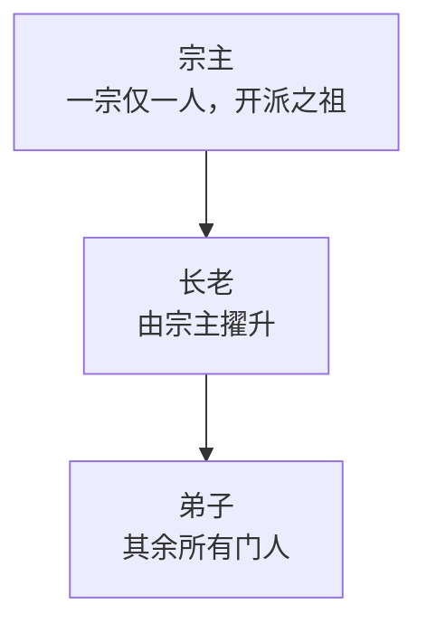

### 宗门

**宗门**是 Cultivation 的公会体系。开宗立派、广收门徒，在一条丰沛的灵脉上占下自己的一座山头，全宗上下的修行便都因此更快一分。持有大殿的宗门还可将一门功法镌于其上、传于全体弟子，在自家地界上布下[阵法](/cultivation/formations/)，在殿中蓄养共享的灵泉，并为了别人的山头而[兴兵](/cultivation/wars/)。

本页所述的一切都受 `Sects-Enabled`（默认 `true`）管辖。将其关闭后，每一条 `/sect` 指令都会客气地回绝，宗门灵气加成不再生效，而磁盘上已有的宗门数据则原封不动。

#### 开宗立派

`/sect create <名称>` 创立宗门，你即为宗主。

- 名称为 3 至 24 个字符，可用字母、数字、空格、连字符与撇号。其余一概不收。
- 名称唯一，且不分大小写 —— 两个宗门不得同名。
- 你身在某宗门时，无法另立门户。
- 一个宗门连宗主在内最多容纳 12 人（`Sect-Max-Members`）。

`/sect info`（别名 `i`）会列出你的门人名录、大殿、殿上碑文与本宗战力。`/sect leave` 是抽身而去 —— 长老之位也一并卸下，因此重新入门并不会不声不响地把权柄还给你。宗主不得一走了之；他只能 `/sect disband`，这会解散宗门、驱散该宗掌控的每一座阵法、作废其未决的邀约，并让大殿灵泉任人采撷。不过单敲 `/sect disband` 只是示警：它会道出宗门之名，并点清即将被逐出山门的弟子人数。唯有 `/sect disband confirm` 才真正落刀，且此事一成，其余门人当场便会收到讯息，而不必等到下次翻开宗门菜单才发觉山门已空。

#### 职位：宗主、长老、弟子

**长老**是居中的职位。唯有宗主可在宗门菜单的成员行中将人擢升或黜落。

| 事项 | 宗主 | 长老 | 弟子 |
|:---|:---|:---|:---|
| 邀请玩家（`/sect invite`） | 可 | 可 | 否 |
| 批准或驳回入门申请 | 可 | 可 | 否 |
| 设定宗训 | 可 | 可 | 否 |
| 逐出普通弟子 | 可 | 可 | 否 |
| 逐出长老 | 可 | 否 | 否 |
| 擢升或黜落长老 | 可 | 否 | 否 |
| 设定入门规矩 | 可 | 否 | 否 |
| 为宗门改名 | 可 | 否 | 否 |
| 设立或迁移大殿（`/sect claim`） | 可 | 否 | 否 |
| 镌刻或抹去殿上碑文（`/sect inscribe`） | 可 | 否 | 否 |
| 兴兵（`/sect war <宗门>`） | 可 | 否 | 否 |
| 解散宗门 | 可 | 否 | 否 |

无人能逐出宗主，长老欲逐另一名长老亦会被回绝。被逐或自行离去，都会清空你的职位与你手上任何未决的入门申请。

`/sect kick` 是照着宗门名录点名的，因此**不在线的门人一样逐得动** —— 而那往往正是你真想清出去的那一位。只要名字对得上名录即可，此人无须眼下就在服务器里。

#### 入门规矩

宗主在宗门菜单**本宗**页的下拉框中，选定外人如何入门。新立的宗门以**邀请制**开局。

| 规矩 | 玩家如何入门 |
|:---|:---|
| **邀请制** | 唯有宗主或长老运行 `/sect invite <玩家>`，再由受邀者运行 `/sect join <名称>`。 |
| **申请制** | 申请者在宗门菜单的浏览页递上申请，由宗主或长老批准或驳回。 |
| **开放制** | 申请者在浏览页即刻入门，无需任何批准。 |

关于邀约与申请：

- 邀约在 300 秒后失效（`Sect-Invite-Expiry-Seconds`）。邀约仅存于内存，因此服务器重启会清空所有未决的邀约。
- `/sect join` 只对尚在有效期内的邀约生效。申请制与开放制的宗门要通过菜单加入，而非这条指令。
- 未决的申请会以「批准／驳回」两行的形式，出现在宗主与长老的**本宗**页中。它们随宗门一同存档。
- 每一条路径都会重新核对 12 人上限；而申请人若在此期间已投他门，其申请会被丢弃而非批准。

#### 宗训与改名

宗主或长老可在菜单中设定**宗训** —— 自由文本，会去除首尾空白并截断至 60 字符。它显示在菜单中宗门名称的下方。v0.7.0 新增：宗训会在真正意义重大的那一刻被念出来 —— 玩家加入或离开宗门时看到的[屏幕标题](/cultivation/notices/)下方，会带着这句宗训。（被逐出者则被有意不显示它。）

唯有宗主可为宗门**改名**，而新名字要经过与立派时完全相同的合法性与唯一性校验。改名会把一切以旧名为键的东西一并带走：

- 该宗掌控的每一座[阵法](/cultivation/formations/)，如此宗门自家的阵法才不会突然把门人当作外人；
- 大殿共享的灵泉，及其中所蓄的一切（见[洞府](/cultivation/dwelling/)）；
- 每一份未决的邀约，如此受邀者仍能以新名接受。

#### 宗门大殿

`/sect claim` 将你所立的区块占为宗门大殿。唯有宗主可行此事。

- 该区块须有至少 1 阶的灵脉 —— 即一条**丰灵脉** —— 此为默认（`Sect-Hall-Min-Vein-Tier`；设为 2 则要求**龙脉**）。寻常区块永远承载不了大殿，而这正是好灵脉值得争夺的原因。
- 一宗一殿。再次占取只是把大殿迁走。
- 两个宗门不得占据同一区块。

已设立的大殿会为全体门人支付一份**宗门灵气加成**，作用于每一处灵气来源 —— 打坐、修行之核、灵泉采撷，一律在内 —— 并与你的种族、天赋树、丹药与大道倍率一同相乘：

| 大殿所踞 | 灵气加成 | 配置项 |
|:---|:---|:---|
| 丰灵脉（1 阶） | +5% | `Sect-Qi-Bonus-Percent-Rich-Hall` |
| 龙脉（2 阶） | +8% | `Sect-Qi-Bonus-Percent-Dragon-Hall` |

没有大殿的宗门分文加成也无。大殿一旦在围攻中失守，全体门人的加成同时中断。

当 `Sect-Hall-Spring-Enabled` 为开时，大殿还会蓄养宗门共享的**灵泉** —— 灵泉随大殿而动，故迁殿即迁泉，而失殿则将灵泉连同其中所蓄，一并送予胜者。灵泉如何积蓄与采撷，见[洞府](/cultivation/dwelling/)。

#### 光柱与旗帜

v0.7.0 新增：已占的大殿会立起一道**光柱**，任何路过之人皆可望见，不止门中弟子 —— 大殿从此是天地间一处真实、可争夺的存在，而不再只是宗门自己心知肚明的一笔记录。光柱每隔 `Sect-Hall-Beacon-Interval-Seconds`（2.5 秒）便重新一现，并可用 `Sect-Hall-Beacon-Enabled` 在全服范围内关闭 —— 见[宗门社群配置](/cultivation/config/society/)。

默认情况下，光柱之色与殿下灵脉相符。宗主或长老可改为**升起一面旗帜** —— 或在宗门菜单的**山门旗帜**选择栏中选取，或以 `/sect banner <名称>` 指定。模组随附六面旗帜：

| 旗帜 | Id | 颜色 | 分组 |
|:---|:---|:---|:---|
| **青龙** | `cultivation:azure` | 青色 | 四象 |
| **朱雀** | `cultivation:vermilion` | 朱红色 | 四象 |
| **白虎** | `cultivation:white` | 白色 | 四象 |
| **玄武** | `cultivation:black` | 深靛蓝色 | 四象 |
| **金庭** | `cultivation:golden` | 金色 | 宗门本色 |
| **玉台** | `cultivation:jade` | 玉色 | 宗门本色 |

- `/sect banner` 不带参数时，会列出本宗可升起的旗帜，并标出当前所悬的那一面。简称（`azure`）与完整 id 皆可用；`/sect banner none` 则归回**本色灵光**。
- 尚无大殿的宗门也可先行择旗 —— 待大殿一经占取，旗帜便随之升起。
- 大殿一旦在围攻中失守，光柱便退回灵脉本色 —— 这便是山谷在任何信使赶到之前，抢先告诉你此地已经易主的方式。旗帜的选择留在宗门身上，故而日后重新占得大殿，同一面旗帜仍会再度升起。
- 扩展可经由 [`registerSectBanner`](/cultivation/api/registries/) 注册更多旗帜；内置的这六面皆不受权限节点管辖。

每一座已占的大殿，也都**钉上了 Hytale 自身的世界地图** —— 无论见者是否本宗门人 —— 以其旗帜之色着色，并标注宗门之名。此标记不受 `Sect-Hall-Beacon-Enabled` 影响。

#### 殿上碑文

**碑文**让宗门得以一次性向全体弟子传授一门功法。手持一本功法[秘籍](/cultivation/manuals/)立于自家大殿之中，运行 `/sect inscribe` 即可。

- 仅限宗主，且你必须立在大殿所在的那个区块上 —— 此法是要亲手刻进那片土地的。
- 秘籍会被消耗，但只在碑文确实刻成之后。若秘籍无法从你手中取走，碑文会被直接回滚，而不是让全宗白得一门无人付账的功法。
- 唯有传授**功法**的秘籍才行得通。天赋树秘籍授予的是永久属性节点，故而遭拒 —— 因为大殿倾覆之时，永久节点是收不回来的。
- 同时只能有一道碑文。再次镌刻会不声不响地取代原有的那道 —— 旧的功法就此消失。

**空手**运行 `/sect inscribe`，则是把殿上刻痕**尽数抹去**，从每一名门人处收走此法，且分文不退。

碑文存于大殿，而非任何人的脑中。它在每一次功法检查时实时解算，这意味着：

- 只要宗门还持有大殿，每一名门人无需亲自读过秘籍，也能施展碑上之法。
- 宗门一旦失去大殿 —— 于围攻中被夺、主动放弃，或宗门解散 —— 此法便从所有门人身上同时消失，无需任何清理流程。
- 碑文本身存在宗门之上，因此日后另立新殿的宗门，会把旧日的碑文取回。
- 门人登入时会被提醒他们正借用着哪一门功法，而 `/sect info` 只在大殿确实在手时才会列出它。

将 `Sect-Inscription-Enabled` 设为 `false` 即可整体关闭此功能；关闭期间碑文立刻停止授法。

#### 战力与排行

宗门的**战力**，是排行榜所见过的每一名门人的全局修为等级之和，其中一名门人贡献 `境界 × 4 + 阶段 + 1`。人多、境界高的宗门排名更前。

`/sect top`（别名 `leaderboard`）列出战力前 10 的宗门及其人数。宗门菜单的**排行**页则显示前 20。

#### 宗门菜单

裸写 `/sect`，或 `/sect menu`（别名 `ui`），即可打开宗门菜单 —— 本页所有指令的图形化门面。共三页：

- **本宗** —— 你的门人名录，附逐人的逐出与擢升／黜落按钮、未决的入门申请、给管理者的宗训／改名／规矩／邀请控件、**山门旗帜**选择栏，以及占殿、离宗与解散诸项。
- **浏览** —— 服务器上的所有宗门，按名称排序，在规矩允许的宗门上附有加入或申请按钮。
- **排行** —— 战力前 20 的宗门。

门人名录中的每一行，会在其名前显示该门人当前佩戴的[称号](/cultivation/titles/)；HUD 也可携带一行**宗门行**，标出你所属的宗门 —— 一旦入宗即会显示，可在设置中的**显示所属宗门**处关闭。

#### 指令

| 指令 | 说明 | 权限 |
|:---|:---|:---|
| `/sect` | 打开宗门菜单。 | `cultivation.sect` |
| `/sect create <名称>` | 创立宗门，你为宗主。 | `cultivation.sect` |
| `/sect invite <玩家>` | 邀请一名玩家（宗主或长老）。 | `cultivation.sect` |
| `/sect join <宗门>` | 接受该宗门尚在有效期内的邀约。 | `cultivation.sect` |
| `/sect leave` | 离开宗门（宗主不可）。 | `cultivation.sect` |
| `/sect kick <玩家>` | 移除一名门人，在线与否皆可（宗主或长老）。 | `cultivation.sect` |
| `/sect claim` | 将你所立的区块占为大殿（宗主）。 | `cultivation.sect` |
| `/sect inscribe` | 将手中的功法秘籍镌于殿上，或空手将其抹去（宗主）。 | `cultivation.sect` |
| `/sect banner [banner]` | 列出、升起或降下山门旗帜（宗主或长老）；传入 `none` 收起旗帜。 | `cultivation.sect` |
| `/sect war <宗门>` | 发起围攻；写作 `/sect war status` 则查看本宗当前战况。见[宗门攻伐](/cultivation/wars/)。 | `cultivation.sect` |
| `/sect info` | 列出本宗的门人、大殿、旗帜、碑文与战力。 | `cultivation.sect` |
| `/sect top` | 列出战力前 10 的宗门。 | `cultivation.sect` |
| `/sect menu` | 打开宗门菜单。 | `cultivation.sect` |
| `/sect disband [confirm]` | 先行示警；加 `confirm` 方才解散宗门（宗主）。 | `cultivation.sect` |

`cultivation.sect` 默认对所有人开放；职位的核查发生在宗门内部，而非权限系统之中。

本页提到的每一个字段 —— `Sect-Max-Members`、`Sect-Hall-Min-Vein-Tier`、两项灵气加成百分比、`Sect-Invite-Expiry-Seconds` 与 `Sect-Inscription-Enabled` —— 皆位于宗门社群配置之中；完整参考见[宗门社群配置](/cultivation/config/society/)，模组的全部指令见[指令](/cultivation/commands/)页。
